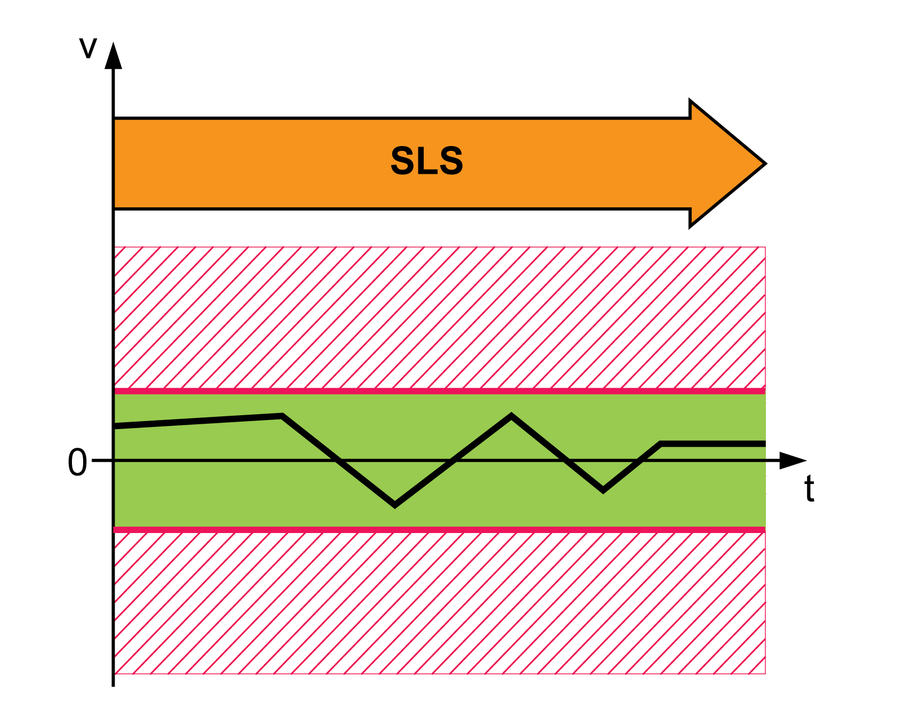
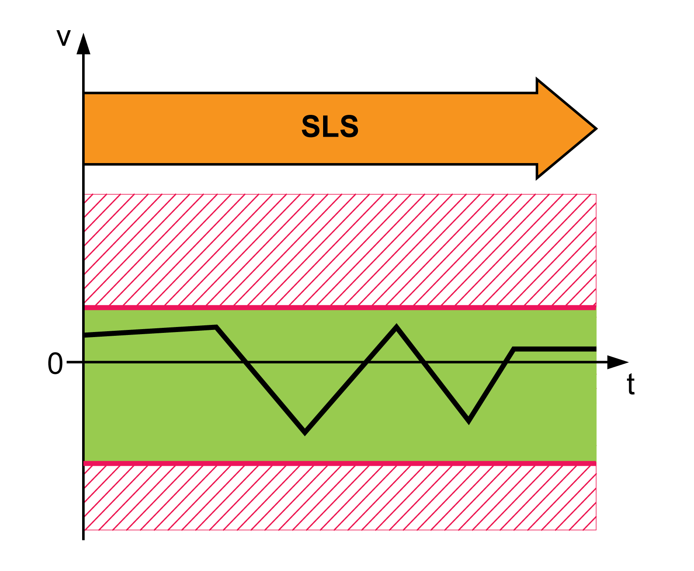

# Safety-Related Function SLS

## Overview

The safety-related function SLS (Safely Limited Speed) monitors adjustable speed limits.

|  |  |
| --- | --- |
| Machine operating mode | SLS monitors speed limits: |
| Automatic Mode | Independent of direction of movement |
| Setup Mode | Independent of direction of movement |
| Setup Mode | Dependent on direction of movement(1) |
| **(1)** Available as of firmware version ≥1.01. The firmware version of the drive and of the safety module eSM can be read determined with the commissioning software. | |

NOTE: Inverting the direction of movement via the parameter InvertDirOfMove in the drive is not taken into account by the safety module eSM.

## SLS Independent of Direction of Movement - General

The safety-related function SLS monitors the following speed limits independently of the direction of movement:

* Machine operating mode Automatic Mode: Value of the parameter eSM\_v\_maxAuto, parameter value >0.
* Machine operating mode Setup Mode: Value of the parameter eSM\_v\_maxSetup for speed limit in positive and negative directions of movement.

  **NOTE**: Safety modules eSM with a firmware version ≥1.01 require the following parameter values to be set (factory setting):

  + eSM\_FuncSwitches: Bit 0 = 0
  + eSM\_SLSnegDirS: Parameter value = 0

| Parameter name  HMI menu  HMI name | Description | Unit  Minimum value  Factory setting  Maximum value | Data type  R/W  Persistent  Expert | Parameter address via fieldbus |
| --- | --- | --- | --- | --- |
| eSM\_v\_maxAuto | eSM speed limit for machine operating mode Automatic Mode.  This value sets the speed limit for monitoring in machine operating mode Automatic Mode.  Value 0: The speed limit is not monitored  Value >0: Monitored speed limit  Type: Unsigned decimal - 2 bytes  Write access via Sercos: CP2, CP3, CP4  Setting can only be modified if power stage is disabled. | RPM  0  0  8000 | UINT16  R/W  per.  - | - |
| eSM\_v\_maxSetup | eSM speed limit for machine operating mode Setup Mode.  This value sets the speed limit for monitoring in machine operating mode Setup Mode.  Firmware version safety module eSM ≥V01.01:  Parameter eSM\_FuncSwitches Bit 0 = 0: Value = Monitored speed limit for positive and negative directions of movement.  Parameter eSM\_FuncSwitches Bit 0 = 1: Value = Monitored speed limit for positive direction of movement.  Type: Unsigned decimal - 2 bytes  Write access via Sercos: CP2, CP3, CP4  Setting can only be modified if power stage is disabled. | RPM  0  0  8000 | UINT16  R/W  per.  - | - |
| eSM\_FuncSwitches | eSM switches for functions.  **None**: No function  **DirectionDependentSLS**: SLS dependent on direction of movement  **Reserved (Bit 1)**: Reserved (bit 1)  **Reserved (Bit 2)**: Reserved (bit 2)  **Reserved (Bit 3)**: Reserved (bit 3)  **Reserved (Bit 4)**: Reserved (bit 4)  **Reserved (Bit 5)**: Reserved (bit 5)  Available as of firmware version safety module eSM ≥V01.01.  Bit 0 = 0: SLS independent of direction of movement  Bit 0 = 1: SLS dependent on direction of movement  Bits 1 … 15: Reserved (must be set to 0)  Type: Unsigned decimal - 2 bytes  Write access via Sercos: CP2, CP3, CP4  Setting can only be modified if power stage is disabled. | -  0  0  63 | UINT16  R/W  per.  - | - |
| eSM\_SLSnegDirS | eSM speed limit negative direction machine operating mode Setup Mode.  Firmware version safety module eSM ≥V01.01.  Parameter eSM\_FuncSwitches Bit 0 = 1: Value = Monitored speed limit for negative direction of movement.  Type: Unsigned decimal - 2 bytes  Write access via Sercos: CP2, CP3, CP4  Setting can only be modified if power stage is disabled. | RPM  0  0  8000 | UINT16  R/W  per.  - | - |

## SLS Independent of Direction of Movement - Response to Exceedance of Limit Value

If the monitored limit value is exceeded for the first time:

* An error is detected.
* The safety module eSM requests a Quick Stop from the drive and monitors the Quick Stop ramp.

  + If the Quick Stop is executed properly, the safety-related function SOS is triggered.
  + If the Quick Stop is not executed properly, the safety-related function STO is triggered.

If the monitored limit value is exceeded again:

* The safety-related function STO is triggered.

| Parameter name  HMI menu  HMI name | Description | Unit  Minimum value  Factory setting  Maximum value | Data type  R/W  Persistent  Expert | Parameter address via fieldbus |
| --- | --- | --- | --- | --- |
| eSM\_dec\_Qstop | eSM deceleration ramp for Quick Stop.  Deceleration ramp for monitored Quick Stop. This value must be greater than 0.  Value 0: eSM module is not configured  Value >0: Deceleration ramp in RPM/s  Type: Unsigned decimal - 4 bytes  Write access via Sercos: CP2, CP3, CP4  Setting can only be modified if power stage is disabled. | RPM/s  0  0  32786009 | UINT32  R/W  per.  - | - |

## SLS Dependent on Direction of Movement - General

In the machine operating mode Setup Mode, the limited speed can be monitored depending on the direction of movement. The limited speeds are set and monitored via one parameter each for positive and negative direction of movement. This requires a safety module eSM with a firmware version ≥1.01.

* Machine operating mode Automatic Mode: refer to [SLS Independent of Direction of Movement - General](#D-SE-0077585__D-SE-0077585.3).
* Machine operating mode Setup Mode: Parameterizable speed limits for movements in positive and in negative directions of movement via the following parameters:

  + Parameter eSM\_FuncSwitches: Activation of direction-dependent SLS, bit 0 = 1.
  + Parameter eSM\_v\_maxSetup: Setting the speed limit for movements in positive direction of movement, parameter value >0.
  + Parameter eSM\_SLSnegDirS: Setting the speed limit for movements in negative direction of movement, parameter value >0.

| Parameter name  HMI menu  HMI name | Description | Unit  Minimum value  Factory setting  Maximum value | Data type  R/W  Persistent  Expert | Parameter address via fieldbus |
| --- | --- | --- | --- | --- |
| eSM\_FuncSwitches | eSM switches for functions.  **None**: No function  **DirectionDependentSLS**: SLS dependent on direction of movement  **Reserved (Bit 1)**: Reserved (bit 1)  **Reserved (Bit 2)**: Reserved (bit 2)  **Reserved (Bit 3)**: Reserved (bit 3)  **Reserved (Bit 4)**: Reserved (bit 4)  **Reserved (Bit 5)**: Reserved (bit 5)  Available as of firmware version safety module eSM ≥V01.01.  Bit 0 = 0: SLS independent of direction of movement  Bit 0 = 1: SLS dependent on direction of movement  Bits 1 … 15: Reserved (must be set to 0)  Type: Unsigned decimal - 2 bytes  Write access via Sercos: CP2, CP3, CP4  Setting can only be modified if power stage is disabled. | -  0  0  63 | UINT16  R/W  per.  - | - |
| eSM\_v\_maxSetup | eSM speed limit for machine operating mode Setup Mode.  This value sets the speed limit for monitoring in machine operating mode Setup Mode.  Firmware version safety module eSM ≥V01.01:  Parameter eSM\_FuncSwitches Bit 0 = 0: Value = Monitored speed limit for positive and negative directions of movement.  Parameter eSM\_FuncSwitches Bit 0 = 1: Value = Monitored speed limit for positive direction of movement.  Type: Unsigned decimal - 2 bytes  Write access via Sercos: CP2, CP3, CP4  Setting can only be modified if power stage is disabled. | RPM  0  0  8000 | UINT16  R/W  per.  - | - |
| eSM\_SLSnegDirS | eSM speed limit negative direction machine operating mode Setup Mode.  Firmware version safety module eSM ≥V01.01.  Parameter eSM\_FuncSwitches Bit 0 = 1: Value = Monitored speed limit for negative direction of movement.  Type: Unsigned decimal - 2 bytes  Write access via Sercos: CP2, CP3, CP4  Setting can only be modified if power stage is disabled. | RPM  0  0  8000 | UINT16  R/W  per.  - | - |

In the case of rotary motors, direction of movement is defined in accordance with IEC 61800-7-204: Positive direction is when the motor shaft rotates clockwise as you look at the end of the protruding motor shaft.

NOTE: Inverting the direction of movement via the parameter InvertDirOfMove in the drive is not taken into account by the safety module eSM.

## SLS Dependent on Direction of Movement - Response to Exceedance of Limit Value

If the monitored limit value is exceeded for the first time:

* An error is detected.
* The safety module eSM requests a Quick Stop from the drive and monitors the Quick Stop ramp.

  + If the Quick Stop is executed properly, the safety-related function SOS is triggered.
  + If the Quick Stop is not executed properly, the safety-related function STO is triggered.

If the monitored limit value is exceeded again:

* The safety-related function STO is triggered.

| Parameter name  HMI menu  HMI name | Description | Unit  Minimum value  Factory setting  Maximum value | Data type  R/W  Persistent  Expert | Parameter address via fieldbus |
| --- | --- | --- | --- | --- |
| eSM\_dec\_Qstop | eSM deceleration ramp for Quick Stop.  Deceleration ramp for monitored Quick Stop. This value must be greater than 0.  Value 0: eSM module is not configured  Value >0: Deceleration ramp in RPM/s  Type: Unsigned decimal - 4 bytes  Write access via Sercos: CP2, CP3, CP4  Setting can only be modified if power stage is disabled. | RPM/s  0  0  32786009 | UINT32  R/W  per.  - | - |

EIO0000004594.00

© 2021

Schneider Electric.

All rights reserved.