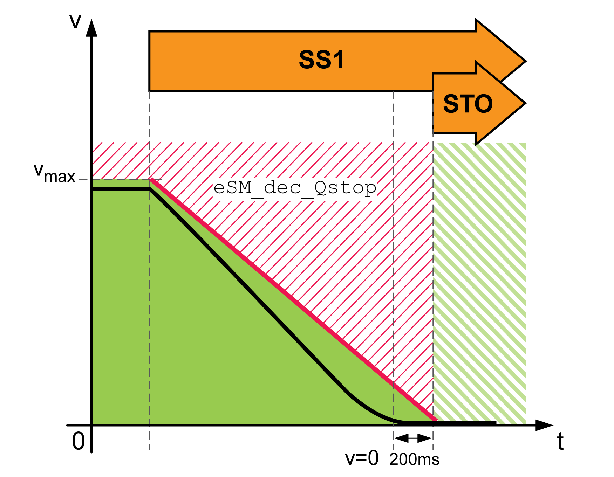

# Safety-Related Function SS1

## Overview

The safety-related function SS1 (Safe Stop 1) monitors the deceleration and removes the motor torque once standstill has been reached (type SS1-r, ramp-monitored).

When the safety-related function is triggered:

* The deceleration of the movement is monitored with the specified monitoring ramp eSM\_dec\_Qstop until standstill is reached.
* After a standstill has been reached, the safety-related function STO is triggered.

| Parameter name  HMI menu  HMI name | Description | Unit  Minimum value  Factory setting  Maximum value | Data type  R/W  Persistent  Expert | Parameter address via fieldbus |
| --- | --- | --- | --- | --- |
| eSM\_dec\_Qstop | eSM deceleration ramp for Quick Stop.  Deceleration ramp for monitored Quick Stop. This value must be greater than 0.  Value 0: eSM module is not configured  Value >0: Deceleration ramp in RPM/s  Type: Unsigned decimal - 4 bytes  Write access via Sercos: CP2, CP3, CP4  Setting can only be modified if power stage is disabled. | RPM/s  0  0  32786009 | UINT32  R/W  per.  - | - |

## Response to Exceedance of Limit Value

If the monitored limit value is exceeded (for a maximum of 4 times):

* An error is detected.
* The safety-related function STO is triggered.
* The number of times the limit value is exceeded is stored (1 ... 4).

If the monitored value is exceeded for the fifth time:

* The safety-related function STO is triggered.
* An error of error class 4 is detected.

EIO0000004594.00

© 2021

Schneider Electric.

All rights reserved.