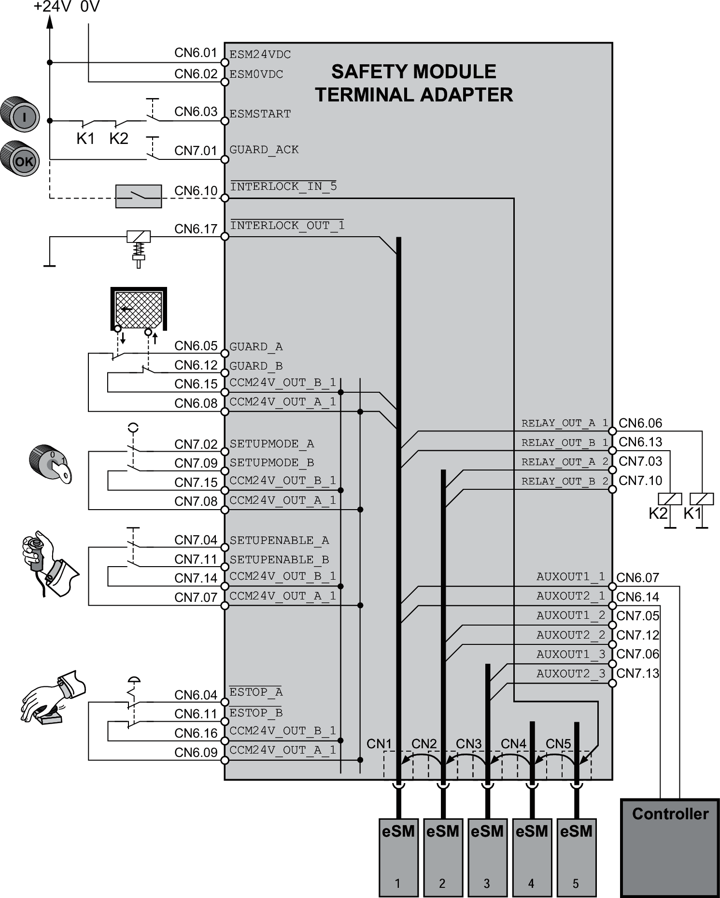

# Overview

## Equipment

| WARNING | |
| --- | --- |
|  | INSUFFICIENT AND/OR INEFFECTIVE SAFETY-RELATED FUNCTIONS  Only connect equipment to the safety-related inputs and outputs that meets all requirements as per your risk assessment and that complies with all regulations, standards, and process definitions applicable to your machine/process.  Failure to follow these instructions can result in death, serious injury, or equipment damage. |

The following equipment can be connected to the inputs and outputs of the safety module eSM:

| Component | Detailed information |
| --- | --- |
| Emergency Stop actuator | [Emergency Stop - General](D-SE-0077631.html#D-SE-0077631) |
| Start/restart pushbutton | [Start/Restart Signal - General](D-SE-0077624.html#D-SE-0077624) |
| Selector switch for selecting the machine operating mode Setup Mode and the machine operating mode Automatic Mode | [Selecting the Machine Operating Mode](D-SE-0077590.html#D-SE-0077590) |
| Interlocking of the guard door, locking device | [Guard Door with Locking Device](D-SE-0077591.html#D-SE-0077591) |
| Guards such as guard doors or electro-sensitive protective equipment (for example, light curtains) | - |
| Enabling device for enabling movements in machine operating mode Setup Mode | [Enabling Device](D-SE-0077592.html#D-SE-0077592) |
| Acknowledge/reset pushbutton for guard door acknowledgement | [Acknowledge/Reset Pushbutton](D-SE-0077593.html#D-SE-0077593) |
| Contactors for switching of external loads (with forcibly guided contacts, if required) | - |
| Controller to request status and diagnostics information via the status outputs | [Status Request via Status Outputs](D-SE-0077588.html#D-SE-0077588) |

NOTE: The term “guard” as used in the present document does not only refer to guard doors, but also to other guarding equipment such as light curtains, where applicable.

The following illustration shows the connection of the equipment mentioned above with an eSM terminal adapter. Depending on your application, less or different equipment may be connected. Wiring is also possible without an eSM terminal adapter.

Equipment connected via eSM terminal adapter:

## Multiple Safety Modules eSM in Multi-Axis System Via eSM Terminal Adapter

Information on wiring of several safety modules eSM in a multi-axis system using an eSM terminal adapter:

* Outputs CCM24V\_OUT\_A and CCM24V\_OUT\_B: These outputs (terminals CN6 and CN7) are internally connected to CN1.
* Outputs RELAY\_OUT\_A\_1 and RELAY\_OUT\_B\_1 (for switching of external loads): These outputs (terminal CN6) are internally connected to CN1.
* Outputs RELAY\_OUT\_A\_2 and RELAY\_OUT\_B\_2 (for switching of external loads): These outputs (terminal CN7) are internally connected to CN2.
* Outputs AUXOUT1\_1 and AUXOUT2\_1: These outputs (terminal CN6) are internally connected to CN1.
* Outputs AUXOUT1\_2 and AUXOUT2\_2: These outputs (terminal CN7) are internally connected to CN2.
* Outputs AUXOUT1\_3 and AUXOUT2\_3: These outputs (terminal CN7) are internally connected to CN3.
* Inputs and supply voltages are internally connected to the connections CN1 ... CN5.
* Connect the first safety module eSM to CN1 of the eSM terminal adapter, the second safety module eSM to CN2, and so on.

If you want to chain the interlock signals (INTERLOCK\_OUT connected to INTERLOCK\_IN of the next safety module eSM) and if you use less than five safety modules eSM, install a "Connector with wire jumper for INTERLOCK signal" (available as an accessory, refer to [Accessories and Spare Parts](D-SE-0060269.html#D-SE-0060269)) in those slots in which no safety module eSM is connected. For example, if you use three safety modules eSM connected to CN1, CN2, and CN3, install the connectors at CN4 and CN5.

If you chain several safety modules eSM, set the parameter eSM\_BaseSetting of the first (that is, the one connected to CN1) safety module eSM (input INTERLOCK\_IN not connected, output INTERLOCK\_OUT connected) to the value INTERLOCK\_IN. If the output INTERLOCK\_OUT of a safety module eSM is not connected, do not set the parameter eSM\_BaseSetting of this safety module eSM to the value INTERLOCK\_IN.

## Flyback Diodes

The outputs of the safety module eSM provide integrated protection against inductive voltage. Additional flyback diodes can slow down the switching behavior of contactors. Refer to [Digital Outputs](D-SE-0077574.html#D-SE-0077574__D-SE-0077574.18) for information on the maximum inductive load on the outputs.

EIO0000004594.00

© 2021

Schneider Electric.

All rights reserved.