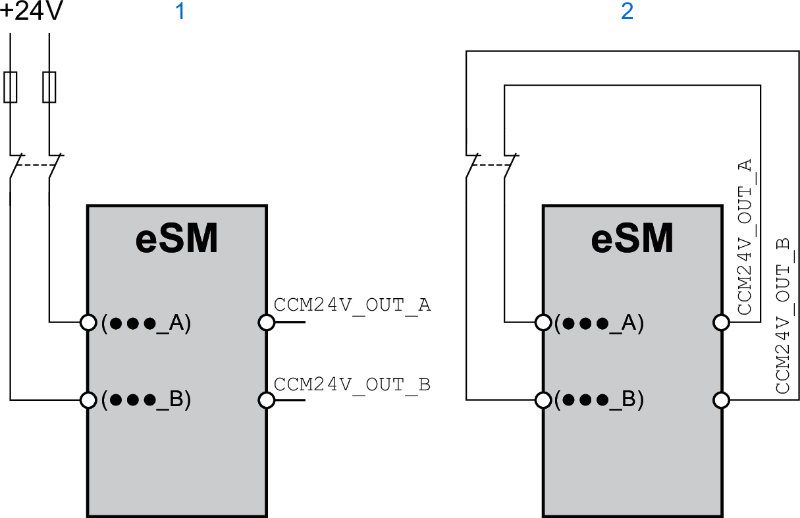
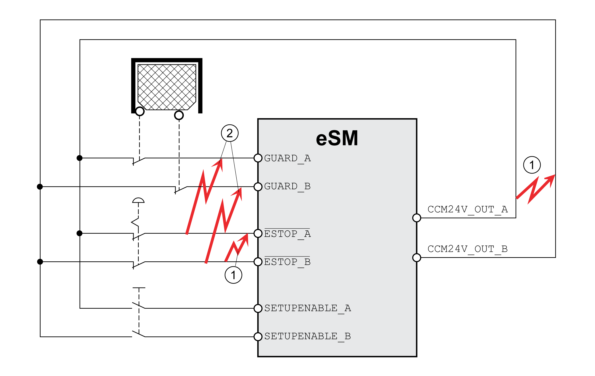

# Wiring of Input Devices/Sensors

## Overview

The following graphic presents dual-channel wiring of safety-related input devices/sensors to the safety module eSM with and without cross-circuit detection:

| 1 | Dual-channel wiring without cross-circuit detection. [Protected cable installation](D-SE-0077581.html#D-SE-0077581__ProtectedCableInstallation-D21CA6CA) as per ISO 13849‑2 is required. |
| 2 | Dual-channel wiring with cross circuit detection. Dual-channel wiring with cross circuit detection allows for the detection of cross circuits between signals whose names have the suffix "\_A" and signals of the same name with the suffix "\_B". [Protected cable installation](D-SE-0077581.html#D-SE-0077581__ProtectedCableInstallation-D21CA6CA) as per ISO 13849‑2 is required. |

## Cross Circuit Detection

The outputs CCM24V\_OUT\_A and CCM24V\_OUT\_B of the safety module eSM provide 24 Vdc supply voltage with cross circuit detection for input devices/sensors with relay output contacts. In the case of dual-channel wiring and supply of the input devices/sensors via CCM24V\_OUT\_A and CCM24V\_OUT\_B, cross circuits between channels and short circuits to other conductors can be detected.

The maximum [safety-related data](D-SE-0077573.html) specified for the safety module eSM (SIL, PL) are reached with and without cross circuit detection.

Cross circuit detection:

| 1 | Cross circuit detection detects cross circuits between signals whose names have the suffix "\_A" and signals of the same name with the suffix "\_B" supplied via the 24 Vdc power supply, for example, between ESTOP\_A and ESTOP\_B. |
| 2 | Cross circuits between signals with different name, but with the same suffix are not detected, for example, cross circuits between ESTOP\_A and GUARD\_A |

EIO0000004594.00

© 2021

Schneider Electric.

All rights reserved.