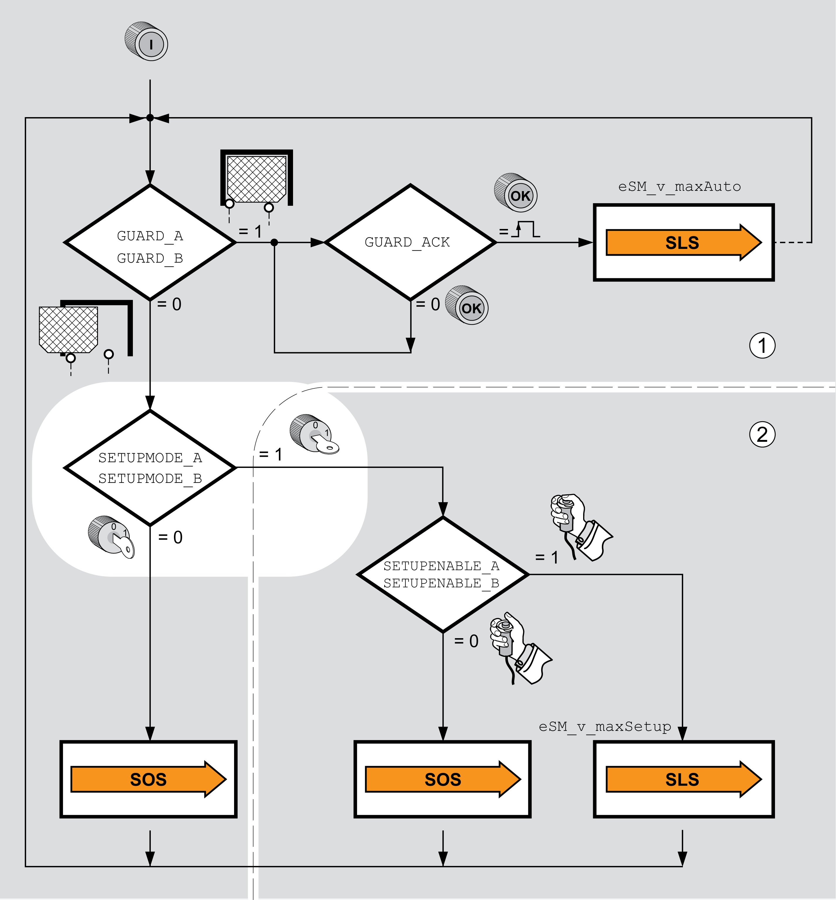

# Selecting the Machine Operating Mode

## Overview

The safety module eSM supports the two machine operating modes Automatic Mode and Setup Mode (refer to [Machine Operating Modes - General](D-SE-0077621.html#D-SE-0077621) for details). The safety module eSM provides the inputs SETUPMODE\_A and SETUPMODE\_B for dual-channel connection of a selector switch for the machine operating modes.

Selecting a machine operating mode (Automatic Mode or Setup Mode):

**1** Automatic Mode

**2** Setup Mode

| Machine operating mode | Required inputs |
| --- | --- |
| Automatic Mode | GUARD\_A and GUARD\_B: Level 1 |
| GUARD\_A and GUARD\_B: Level 0  SETUPMODE\_A and SETUPMODE\_B: Level 0 |
| Setup Mode | GUARD\_A and GUARD\_B: Level 0  SETUPMODE\_A and SETUPMODE\_B: Level 1 |

EIO0000004594.00

© 2021

Schneider Electric.

All rights reserved.