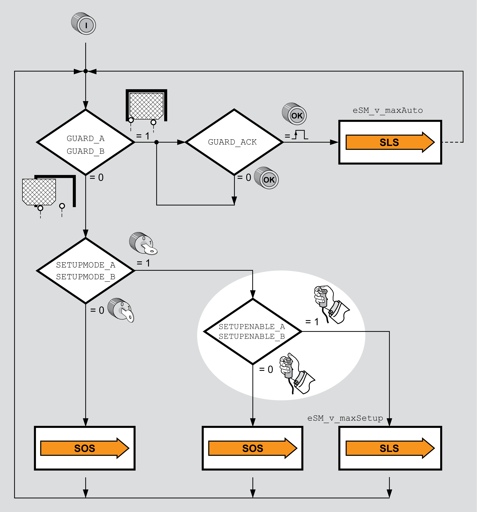

# Enabling Device

## Overview

An enabling device can be used if, for example, in machine operating mode Setup Mode, a movement with open guard door is required and possible as determined by your risk assessment. The velocity is monitored by the safety-related function SLS.

Monitored limited velocity with open guard door with the safety-related function SLS is only possible if the following conditions are met:

* The guard door is open, the level at GUARD\_A and GUARD\_B is 0.
* Machine operating mode Setup Mode is active, the level at the inputs SETUPMODE\_A and SETUPMODE\_B is 1.
* Enabling switch is activated (level at the inputs SETUPENABLE\_A and SETUPENABLE\_B is 1).

Enabling switch:

If the enabling switch is not activated, the safety-related function SOS is active in machine operating mode Setup Mode when the guard door is open.

Wiring:

* Connect the selector switch for the machine operating mode to the inputs SETUPMODE\_A and SETUPMODE\_B of the safety module eSM.
* Connect the enabling device to the inputs SETUPENABLE\_A and SETUPENABLE\_B of the safety module eSM.
* If you want to use cross circuit detection, use the outputs CCM24V\_OUT\_A and CCM24V\_OUT\_B to supply the enabling device.

EIO0000004594.00

© 2021

Schneider Electric.

All rights reserved.