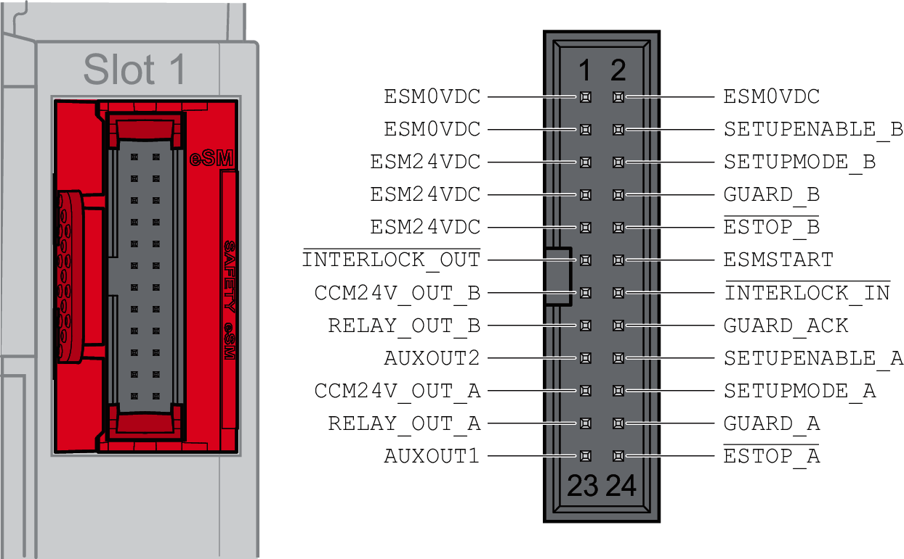
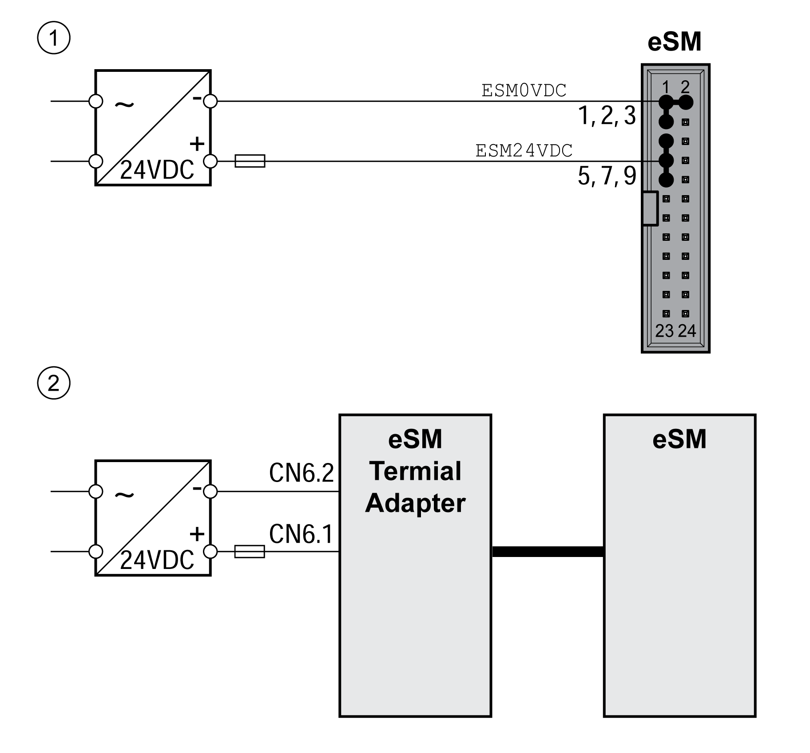

# Installation of the Safety Module eSM

## General

| DANGER | |
| --- | --- |
|  | ELECTRIC SHOCK, EXPLOSION, OR ARC FLASH  * Disconnect all power from all equipment including connected devices prior to removing any covers or doors, or installing or removing any accessories, hardware, cables, or wires. * Place a "Do Not Turn On" or equivalent hazard label on all power switches and lock them in the non-energized position. * Wait 15 minutes to allow the residual energy of the DC bus capacitors to discharge. * Measure the voltage on the DC bus with a properly rated voltage sensing device and verify that the voltage is less than 42 Vdc. * Do not assume that the DC bus is voltage-free when the DC bus LED is off. * Block the motor shaft to prevent rotation prior to performing any type of work on the drive system. * Do not create a short-circuit across the DC bus terminals or the DC bus capacitors. * Replace and secure all covers, accessories, hardware, cables, and wires and confirm that a proper ground connection exists before applying power to the unit. * Use only the specified voltage when operating this equipment and any associated products.  Failure to follow these instructions will result in death or serious injury. |

| DANGER | |
| --- | --- |
|  | ELECTRIC SHOCK OR UNINTENDED EQUIPMENT OPERATION  * Keep foreign objects from getting into the product. * Verify the correct seating of seals and cable entries in order to avoid contamination such as deposits and humidity.  Failure to follow these instructions will result in death or serious injury. |

The safety-related function STO (Safe Torque Off) does not remove power from the DC bus. The safety-related function STO only removes power to the motor. The DC bus voltage and the mains voltage to the drive are still present.

| DANGER | |
| --- | --- |
|  | ELECTRIC SHOCK  * Do not use the safety-related function STO for any other purposes than its intended function. * Use an appropriate switch, that is not part of the circuit of the safety-related function STO, to disconnect the drive from the mains power.  Failure to follow these instructions will result in death or serious injury. |

Conductive foreign objects, dust or liquids may cause safety-related functions to become inoperative.

| WARNING | |
| --- | --- |
|  | LOSS OF SAFETY-RELATED FUNCTION CAUSED BY FOREIGN OBJECTS  Protect the system against contamination by conductive substances.  Failure to follow these instructions can result in death, serious injury, or equipment damage. |

Signal interference can cause unexpected responses of the drive system and of other equipment in the vicinity of the drive system.

| WARNING | |
| --- | --- |
|  | SIGNAL AND EQUIPMENT INTERFERENCE  * Install the wiring in accordance with the EMC requirements described in the present document. * Verify compliance with the EMC requirements described in the present document. * Verify compliance with all EMC regulations and requirements applicable in the country in which the product is to be operated and with all EMC regulations and requirements applicable at the installation site.  Failure to follow these instructions can result in death, serious injury, or equipment damage. |

## Mechanical Installation

Electrostatic discharge (ESD) may permanently damage the module either immediately or over time.

| NOTICE | |
| --- | --- |
|  | EQUIPMENT DAMAGE DUE TO ESD  * Use suitable ESD measures (for example, ESD gloves) when handling the module. * Do not touch internal components.  Failure to follow these instructions can result in equipment damage. |

Commission the drive before installing the safety module eSM if your machine/process permits to do so.

Install the module according to the instructions in the user guide of the drive ([Related Documents](D-SE-0072280.3.html#D-SE-0072280.3__D-SE-0072280.13)).

## Electrical Installation - Interface

The safety module eSM is connected by means of a 24-pin connector.

Refer to [Accessories and Spare Parts](D-SE-0060269.html#D-SE-0060269) for information on suitable cables and terminal adapters for the safety module.

## Electrical Installation - Cable Specifications

| Characteristic | Unit | Value |
| --- | --- | --- |
| Shield | - | Not required |
| Shield connected at one end | - | Not required |
| [Protected cable installation](D-SE-0077581.html#D-SE-0077581__ProtectedCableInstallation-D21CA6CA) as per ISO 13849-2 | - | Required |
| Minimum conductor cross section | mm2 (AWG) | 0.34 (22) |
| Maximum cable length between safety module eSM and eSM terminal adapter | m (ft) | 3 (9.84) |
| NOTE: Do not use ribbon cables. | | |

* Observe the EMC requirements specified in the user guide of the drive ([Related Documents](D-SE-0072280.3.html#D-SE-0072280.3__D-SE-0072280.13)).
* Use pre-assembled cables.
* Verify that wiring, cables and connected interfaces meet the PELV requirements.

## Electrical Installation - STO Inputs of the Drive

The safety-related function STO can be triggered directly via two inputs of the drive (refer to the user guide of the drive ([Related Documents](D-SE-0072280.3.html#D-SE-0072280.3__D-SE-0072280.13))). If you do not want to trigger the safety-related function STO via a signal at the inputs STO\_A and STO\_B of the safety module eSM, connect the inputs STO\_A and STO\_B to +24VDC.

## Electrical Installation - Connecting the Inputs and Outputs

Pin assignment of the eSM connector:

| Pin | Signal | Active level | Explanation | Wire color(1) | I/O |
| --- | --- | --- | --- | --- | --- |
| 1 | ESM0VDC | - | Reference potential supply safety module eSM | White | - |
| 2 | ESM0VDC | - | Reference potential supply safety module eSM | Brown | - |
| 3 | ESM0VDC | - | Reference potential supply safety module eSM | Green | - |
| 4 | SETUPENABLE\_B | 1 | Enabling device, channel B | Yellow | I |
| 5 | ESM24VDC | - | Supply safety module eSM | Gray | - |
| 6 | SETUPMODE\_B | 1 | Activation of the machine operating mode Setup Mode, channel B | Pink | I |
| 7 | ESM24VDC | - | Supply safety module eSM | Blue | - |
| 8 | GUARD\_B | 1 | Guard door, channel B | Red | I |
| 9 | ESM24VDC | - | Supply safety module eSM | Black | - |
| 10 | ESTOP\_B | 0 | Emergency Stop request, channel B | Violet | I |
| 11 | INTERLOCK\_OUT | 0 | Guard locking device of guard door | Pink, gray | O |
| 12 | ESMSTART | 1 | Start/restart signal | Blue, red | I |
| 13 | CCM24V\_OUT\_B | 1 | Supply for input device/sensor, channel B | White, green | O |
| 14 | INTERLOCK\_IN | 0 | Release input for interlock device of guard door | Brown, green | I |
| 15 | RELAY\_OUT\_B | 1 | Relay, channel B (for switching of external loads) | White, yellow | O |
| 16 | GUARD\_ACK | 1 | Acknowledge/reset pushbutton | Yellow, brown | I |
| 17 | AUXOUT2 | 1 | Non-safety-related status output 2 | White, gray | O |
| 18 | SETUPENABLE\_A | 1 | Enabling device, channel A | Gray, brown | I |
| 19 | CCM24V\_OUT\_A | 1 | Supply for input device/sensor, channel A | White, pink | O |
| 20 | SETUPMODE\_A | 1 | Activation of machine operating mode Setup Mode, channel A | Pink, brown | I |
| 21 | RELAY\_OUT\_A | 1 | Relay, channel A (for switching of external loads) | White, blue | O |
| 22 | GUARD\_A | 1 | Guard door, channel A | Brown, blue | I |
| 23 | AUXOUT1 | 1 | Non-safety-related status output 1 | White, red | O |
| 24 | ESTOP\_A | 0 | Emergency Stop request, channel A | Brown, red | I |

(1) Colors of wires of cable VW3M8801R30, refer to [Accessories and Spare Parts](D-SE-0060269.html#D-SE-0060269).

## Electrical Installation - Connecting the 24 Vdc Supply

The 24 Vdc supply voltage is connected with many exposed signal connections in the drive system.

| WARNING | |
| --- | --- |
|  | UNINTENDED EQUIPMENT OPERATION  * Use power supply units that meet the PELV (Protective Extra Low Voltage) requirements. * Connect the 0 Vdc outputs of all power supply units to FE (functional earth/functional ground), for example, for the VDC supply voltage and for the 24 Vdc voltage for the safety-related function STO. * Interconnect all 0 Vdc outputs (reference potentials) of all power supply units used for the drive.  Failure to follow these instructions can result in death, serious injury, or equipment damage. |

Connection of the 24 Vdc supply of the safety module eSM:

**1** Without eSM terminal adapter

**2** With eSM terminal adapter

EIO0000004594.00

© 2021

Schneider Electric.

All rights reserved.