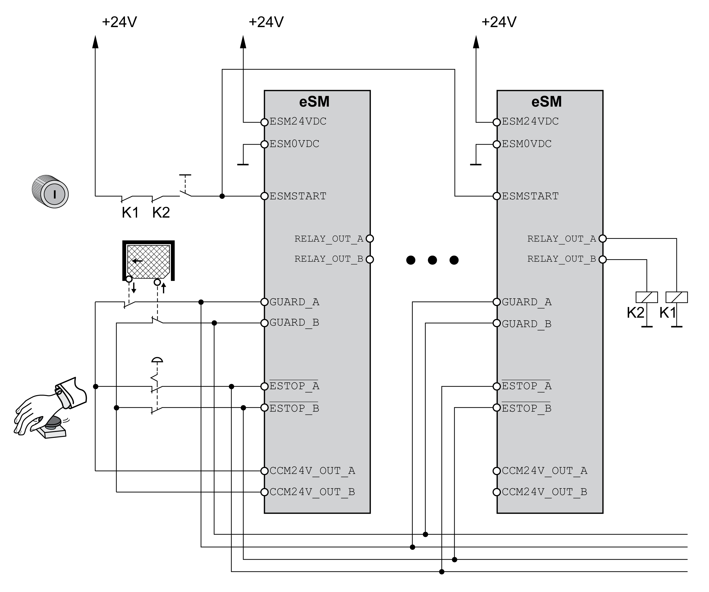

# Wiring for Multi-Axis Systems

## Overview

If you use a single safety-related relay for several axes, connect the inputs of the safety modules eSM in parallel.

Do not connect the outputs of the safety module eSM in parallel.

## Flyback Diodes

The outputs of the safety module eSM provide integrated protection against inductive voltage. Additional flyback diodes can slow down the switching behavior of contactors. Refer to [Electrical Data Module](D-SE-0077574.html#D-SE-0077574) for information on the maximum inductive load on the outputs.

## Wiring Without eSM Terminal Adapter

Wiring of several safety modules eSM without eSM terminal adapter

## Wiring With eSM Terminal Adapter

The eSM terminal adapter available as an [accessory](D-SE-0067420.html#D-SE-0067420) simplifies wiring of several safety modules eSM for multi-axis systems and chaining of the inputs and outputs for guard door interlocking.

Wiring of several safety modules eSM with eSM terminal adapter

Refer to [Multiple Safety Modules eSM in Multi-Axis System Via eSM Terminal Adapter](D-SE-0077594.html#D-SE-0077594__MultipleESMSafety-relatedModulesInM-D004FCB0) for additional details.

EIO0000004594.00

© 2021

Schneider Electric.

All rights reserved.