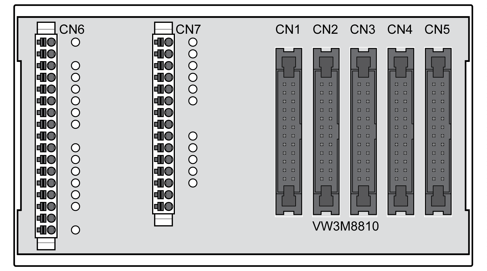

# Installation of the eSM Terminal Adapter

## General Information

The eSM terminal adapter distributes the input signals of a system to the safety modules eSM of up to five drives.

Refer to [Multiple Safety Modules eSM in Multi-Axis System Via eSM Terminal Adapter](D-SE-0077594.html#D-SE-0077594__MultipleESMSafety-relatedModulesInM-D004FCB0) for additional details.

Interlocking of the guard door with the signal INTERLOCK: The input INTERLOCK\_IN (terminal CN6) is internally connected to the input INTERLOCK\_IN of CN5. The output INTERLOCK\_OUT is connected to the input INTERLOCK\_IN of the following connection. The output INTERLOCK\_OUT (terminal CN1) is internally connected to terminal CN6.

## Mounting

The eSM terminal adapter can be mounted to standard DIN rails or type G rails.

eSM terminal adapter:

## Spring Terminals CN6 ... CN7

Cross sections for the spring terminals:

| Characteristic | Unit | Value |
| --- | --- | --- |
| Wire cross section for rigid and flexible cables | [mm2]  (AWG) | 0.2 ... 1.5  (AWG24 ... AWG16) |
| Connection cross section for flexible cable with wire ferrule without plastic collar | [mm2]  (AWG) | 0.25 ... 1.5  (AWG22 ... AWG16) |
| Connection cross section for flexible cable with wire ferrule with plastic collar | [mm2]  (AWG) | 0.25 ... 0.75  (AWG22 ... AWG20) |

## Connection CN6

| Pin | Signal | Active level | Explanation | I/O |
| --- | --- | --- | --- | --- |
| 01 | ESM24VDC | - | Supply safety module eSM | - |
| 02 | ESM0VDC | - | Reference potential supply safety module eSM | - |
| 03 | ESMSTART | 1 | Start/restart signal | I |
| 04 | ESTOP\_A | 0 | Emergency Stop request, channel A | I |
| 05 | GUARD\_A | 1 | Guard door, channel A | I |
| 06 | RELAY\_OUT\_A\_1 | 1 | Relay, channel A (for switching of external loads), connected to CN1 | O |
| 07 | AUXOUT1\_1 | 1 | Non-safety-related status output 1, internally connected to CN1 | O |
| 08 | CCM24V\_OUT\_A\_1 | 1 | Supply input device/sensor, channel A, internally connected to CN1 | O |
| 09 | CCM24V\_OUT\_A\_1 | 1 | Supply input device/sensor, channel A, internally connected to CN1 | O |
| 10 | INTERLOCK\_IN\_5 | 0 | Release input for interlock device of guard door, internally connected to CN5 | I |
| 11 | ESTOP\_B | 0 | Emergency Stop request, channel B | I |
| 12 | GUARD\_B | 1 | Guard door, channel B | I |
| 13 | RELAY\_OUT\_B\_1 | 1 | Relay, channel B (for switching of external loads), internally connected to CN1 | O |
| 14 | AUXOUT2\_1 | 1 | Non-safety-related status output 2, internally connected to CN1 | O |
| 15 | CCM24V\_OUT\_B\_1 | 1 | Supply input device/sensor, channel B, internally connected to CN1 | O |
| 16 | CCM24V\_OUT\_B\_1 | 1 | Supply input device/sensor, channel B, internally connected to CN1 | O |
| 17 | INTERLOCK\_OUT\_1 | 0 | Interlock device of guard door, internally connected to CN1 | O |

## Connection CN7

| Pin | Signal | Active level | Explanation | I/O |
| --- | --- | --- | --- | --- |
| 1 | GUARD\_ACK | 1 | Acknowledge/reset pushbutton | I |
| 2 | SETUPMODE\_A | 1 | Activation of machine operating mode Setup Mode, channel A | I |
| 3 | RELAY\_OUT\_A\_2 | 1 | Relay, channel A (for switching of external loads), internally connected to CN2 | O |
| 4 | SETUPENABLE\_A | 1 | Enabling device, channel A | I |
| 5 | AUXOUT1\_2 | 1 | Non-safety-related status output 1, internally connected to CN2 | O |
| 6 | AUXOUT1\_3 | 1 | Non-safety-related status 1, internally connected to CN3 | O |
| 7 | CCM24V\_OUT\_A\_1 | 1 | Supply input device/sensor, channel A, internally connected to CN1 | O |
| 8 | CCM24V\_OUT\_A\_1 | 1 | Supply input device/sensor, channel A, internally connected to CN1 | O |
| 9 | SETUPMODE\_B | 1 | Activation of the machine operating mode Setup Mode, channel B | I |
| 10 | RELAY\_OUT\_B\_2 | 1 | Relay, channel B (for switching of external loads), internally connected to CN2 | O |
| 11 | SETUPENABLE\_B | 1 | Enabling device, channel B | I |
| 12 | AUXOUT2\_2 | 1 | Non-safety-related status output 2, internally connected to CN2 | O |
| 13 | AUXOUT2\_3 | 1 | Non-safety-related status output 2, internally connected to CN3 | O |
| 14 | CCM24V\_OUT\_B\_1 | 1 | Supply input device/sensor, channel B, internally connected to CN1 | O |
| 15 | CCM24V\_OUT\_B\_1 | 1 | Supply input device/sensor, channel B, internally connected to CN1 | O |

## Connections CN1 ... CN5

The pin assignment of the 24–pin connectors corresponds to the pin assignment of the safety module eSM, refer to [Connecting the Inputs and Outputs](D-SE-0077603.html#D-SE-0077603__D-SE-0077603.7).

Refer to [Accessories and Spare Parts](D-SE-0060269.html#D-SE-0060269) for information on cables and terminal adapters for the safety module eSM.

EIO0000004594.00

© 2021

Schneider Electric.

All rights reserved.