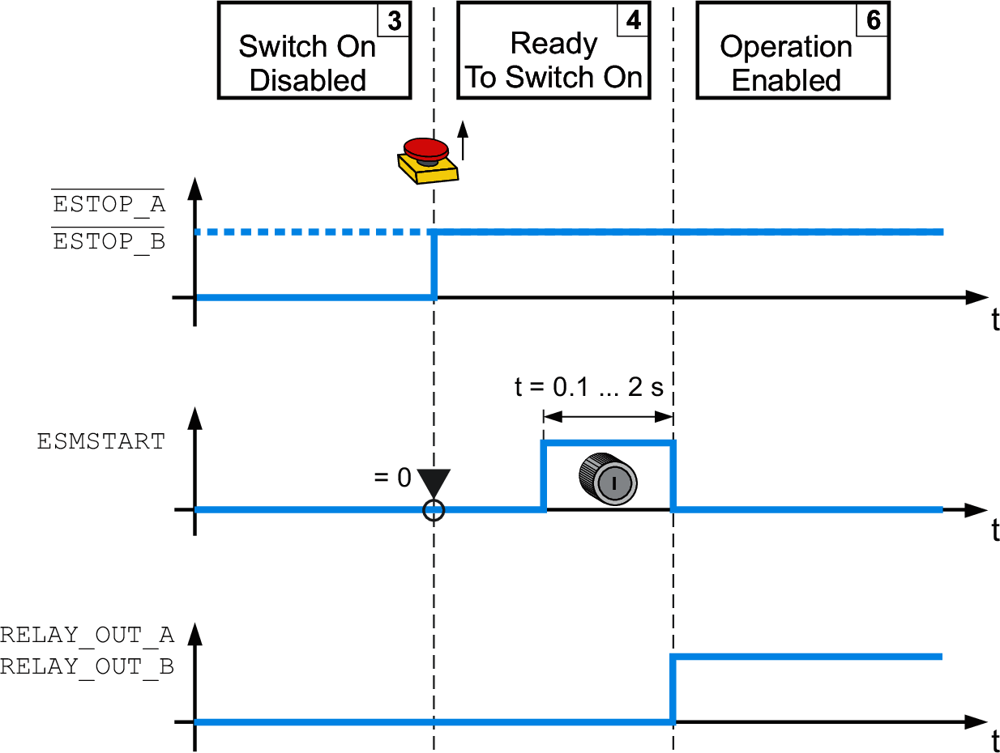

# Manual Start/Restart

## General

In the case of manual start/restart, the power stage is unlocked via a start/restart signal with a defined duration at the input ESMSTART.

Timing of start/restart signal for manual start/restart:

The safety module eSM monitors the duration of the start/restart pulse at the input ESMSTART in order to detect contact welding at the start/restart pushbutton.

If the maximum duration of the start/restart signal is exceeded, the start/restart signal is ignored and an error is detected.

EIO0000004594.00

© 2021

Schneider Electric.

All rights reserved.