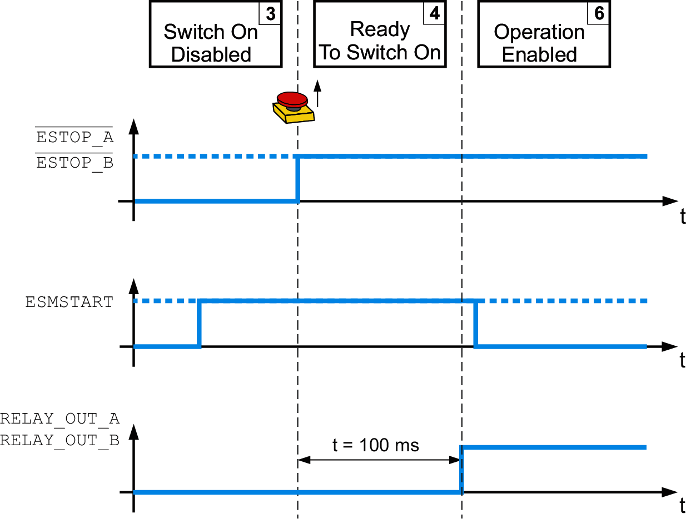
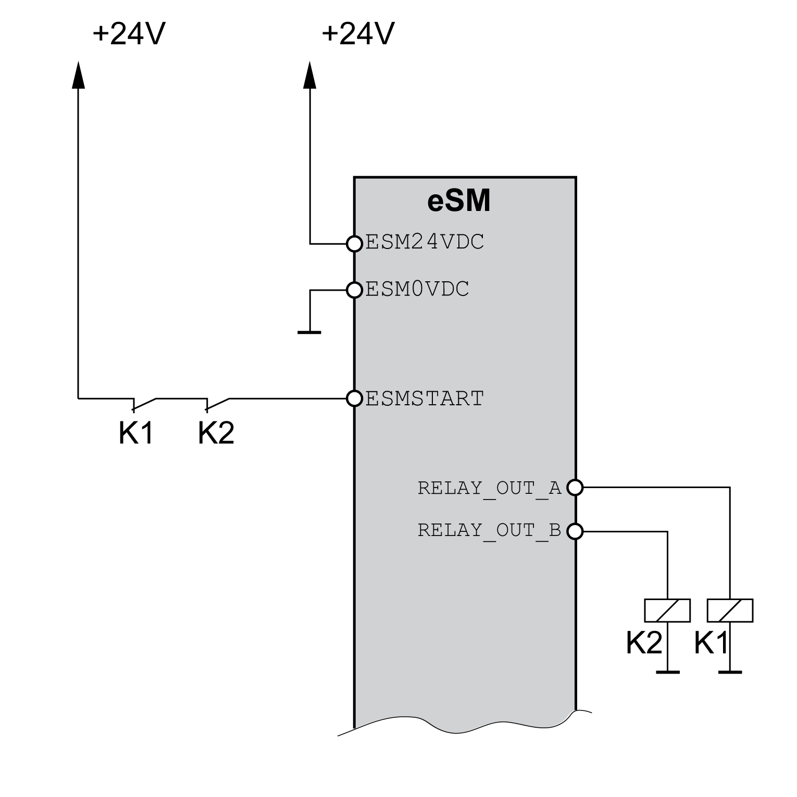

# Automatic Start/Restart

## General

For automatic start/restart, the safety module eSM does not require a start pulse, but a static 24 Vdc signal at the input ESMSTART.

Start signal for automatic start/restart

If automatic start/restart is configured, the safety module eSM verifies that the level at the input ESMSTART is 1.

If the forcibly guided normally closed contacts of the power contactors connected in series to the input ESMSTART are not closed, enabling of the power stage remains inhibited even is automatic start/restart is configured.

## Delay Time for Automatic Start

The fixed delay time can be used to start several interconnected safety modules eSM together. The inputs ESMSTART of the safety modules eSM must be connected in parallel (for example, via the eSM terminal adapter).

One power contactor with forcibly guided normally closed contacts each is connected to the two inputs RELAY\_A and RELAY\_B of one of the interconnected safety modules eSM. The start/restart signal is supplied to the inputs ESMSTART of the other safety modules eSM via the forcibly guided normally closed contacts of the two power contactors connected in series.

Delay time for automatic start:

The start/restart signal is available at the inputs ESMSTART of the safety modules eSM for a period of 100 ms. During this time the connected safety modules eSM must recognize the start signal. When this time has passed, the two power contactors at the outputs RELAY\_A and RELAY\_B switch. The normally closed contacts interrupt the start/restart signal.

Error acknowledgement:

If errors cannot be acknowledged simultaneously for the interconnected safety modules eSM, the error must be acknowledged last at the safety module eSM that controls the power contactors.

EIO0000004594.00

© 2021

Schneider Electric.

All rights reserved.