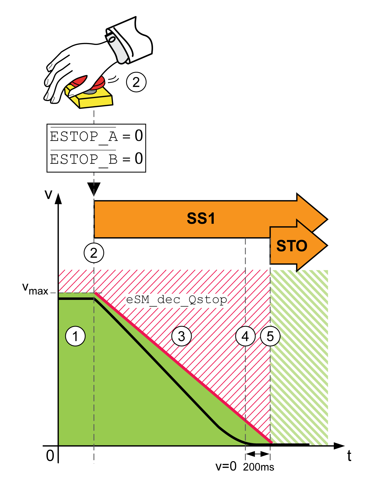
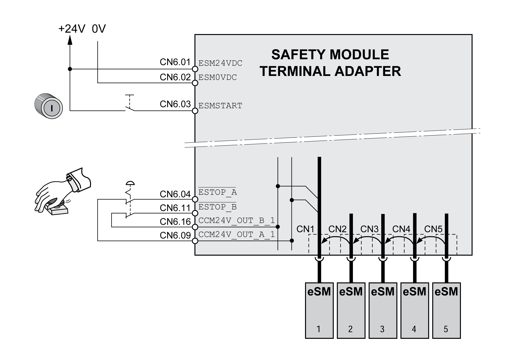
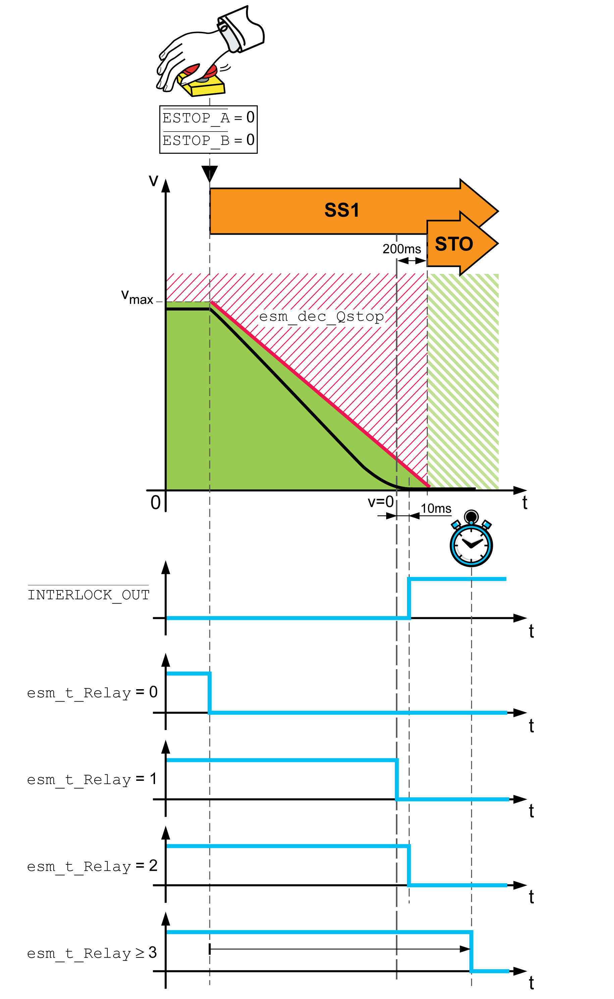

# Integrated Emergency Stop

## Wiring

Wiring of the safety module eSM or the eSM terminal adapter for Emergency Stop:

* Connect the supply voltage to ESM24VDC and ESM0VDC.
* Connect the Emergency Stop pushbutton to ESTOP\_A and ESTOP\_B.
* Connect the start/restart pushbutton to the input ESMSTART.

## Emergency Stop: Category 1 Stop (ESTOP\_A and ESTOP\_B)

If the inputs ESTOP\_A and ESTOP\_B are deactivated (level 0), a Quick Stop and the safety-related function SS1 are triggered. This corresponds to stop category 1 as per IEC 60204-1.

Triggering an Emergency Stop:

The following steps are performed in the case of an Emergency Stop:

| 1 | No Emergency Stop triggered.  The machine operating mode is Automatic Mode or Setup Mode. |
| 2 | An Emergency Stop is triggered via the inputs ESTOP\_A and ESTOP\_B (level 0)  The safety module eSM request a Quick Stop.  The safety-related function SS1 is triggered. |
| 3 | The deceleration ramp is monitored by the safety-related function SS1. |
| 4 | The velocity is zero.  A delay time of 200 ms starts.  If a holding brake is present, it can be applied. |
| 5 | The delay time has elapsed.  The safety-related function STO is active. |

| Parameter name  HMI menu  HMI name | Description | Unit  Minimum value  Factory setting  Maximum value | Data type  R/W  Persistent  Expert | Parameter address via fieldbus |
| --- | --- | --- | --- | --- |
| eSM\_dec\_Qstop | eSM deceleration ramp for Quick Stop.  Deceleration ramp for monitored Quick Stop. This value must be greater than 0.  Value 0: eSM module is not configured  Value >0: Deceleration ramp in RPM/s  Type: Unsigned decimal - 4 bytes  Write access via Sercos: CP2, CP3, CP4  Setting can only be modified if power stage is disabled. | RPM/s  0  0  32786009 | UINT32  R/W  per.  - | - |

## Integrated Emergency Stop: Wiring with eSM Terminal Adapter

Wiring of Emergency Stop with evaluation of the signal state of a start/restart pushbutton via eSM terminal adapter:

Refer to [Multiple Safety Modules eSM in Multi-Axis System Via eSM Terminal Adapter](D-SE-0077594.html#D-SE-0077594__MultipleESMSafety-relatedModulesInM-D004FCB0) for additional details.

## Deenergizing Other Consumers

If other consumers are to be deenergized via the safety module eSM or contact multiplication is to be implemented, power contactors with forcibly guided contacts can be connected to the outputs RELAY\_OUT\_A and RELAY\_OUT\_B. Connect one power contactor to each output of a pair of of outputs, for example, K1 to RELAY\_OUT\_A\_1 and K2 to RELAY\_OUT\_B\_1. The forcibly guided, normally closed contacts of the power contactors must be connected in series with the start/restart pushbutton (ESMSTART), refer to [Evaluation of the Start/Restart Signal - General](D-SE-0077624.html#D-SE-0077624).

If the power contactors are used to apply or remove mains voltage, the power contactors must meet the requirement of protective separation.

If an error is detected, you can reset it by triggering an Emergency Stop.

## Delay Time for Other Consumers

It is possible to deenergize other consumers after a delay time:

* After a fixed delay time
* When the movement has come to a standstill

Timing for deactivation of the RELAY output:

The parameter eSM\_t\_Relay lets you set the timing for deactivation.

| Parameter name  HMI menu  HMI name | Description | Unit  Minimum value  Factory setting  Maximum value | Data type  R/W  Persistent  Expert | Parameter address via fieldbus |
| --- | --- | --- | --- | --- |
| eSM\_t\_Relay | eSM deactivation of output RELAY.  Deactivation of the digital output RELAY:  Value 0: Immediate, no time delay  Value 1: At motor standstill (v = 0)  Value 2: At motor standstill (v = 0) and /INTERLOCK\_OUT = 1  Value >2: Time delay in ms, deactivation of output after this time has passed  Type: Unsigned decimal - 2 bytes  Write access via Sercos: CP2, CP3, CP4  Setting can only be modified if power stage is disabled. | ms  0  0  10000 | UINT16  R/W  per.  - | - |

The outputs of the safety module eSM provide integrated protection against inductive voltage. Additional flyback diodes can slow down the switching behavior of contactors. Refer to [Electrical Data Module](D-SE-0077574.html#D-SE-0077574) for information on the maximum inductive load on the outputs.

| Event | Value of parameter eSM\_t\_Relay | Outputs RELAY\_OUT |
| --- | --- | --- |
| Error of error class 1 detected | Any | The outputs RELAY\_OUT are not deactivated. |
| Error of error class 2 detected (Emergency Stop) | 0 | Outputs RELAY\_OUT are immediately deactivated (without time delay). |
| 1 | The outputs RELAY\_OUT are deactivated when the motor is at a standstill (v = 0). |
| 2 | The outputs RELAY\_OUT are deactivated when the motor is at a standstill (v = 0) and if the level at the output INTERLOCK\_OUT is 1. |
| ≥ 3 | The outputs RELAY\_OUT are deactivated after the parameterizable delay time eSM\_t\_Relay [ms] has passed. |
| Error of classes 3 or 4 detected | Any | The outputs RELAY\_OUT are deactivated immediately, irrespective of the settings in the parameter eSM\_t\_Relay. |

EIO0000004594.00

© 2021

Schneider Electric.

All rights reserved.