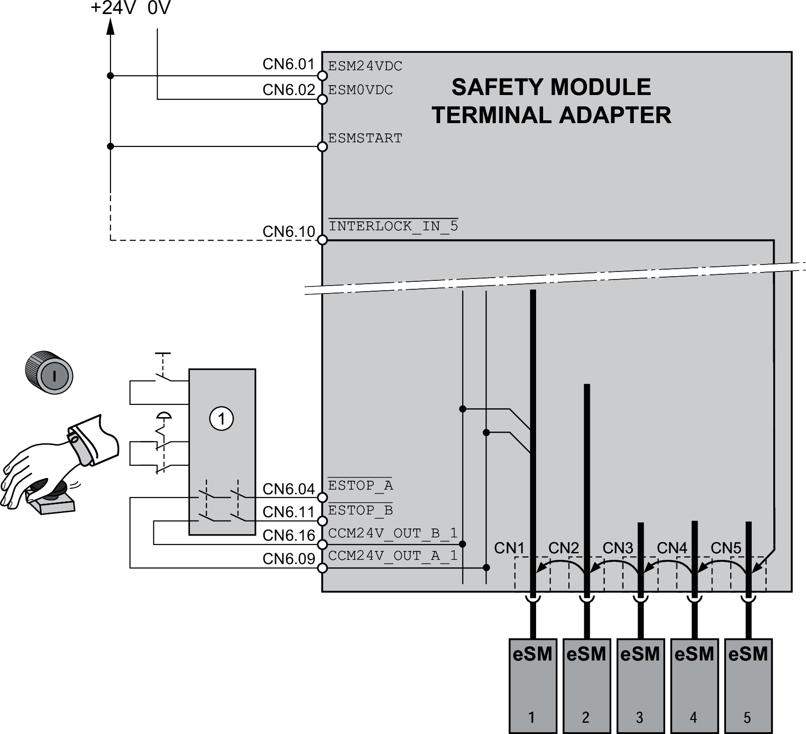

# Emergency Stop with External Safety Relay

## Wiring

If the external safety relay requires a start signal, an additional start signal at the safety module eSM is not needed. Automatic Start needs to be activated via the parameter eSM\_BaseSetting.

Emergency Stop with external safety relay (1) and Automatic Start:

| Parameter name  HMI menu  HMI name | Description | Unit  Minimum value  Factory setting  Maximum value | Data type  R/W  Persistent  Expert | Parameter address via fieldbus |
| --- | --- | --- | --- | --- |
| eSM\_BaseSetting | eSM basic settings.  **None**: No function  **Auto Start**: Automatic start (ESMSTART)  **Ignore GUARD\_ACK**: GUARD\_ACK inactive  **Ignore /INTERLOCK\_IN**: INTERLOCK chain inactive  Type: Unsigned decimal - 2 bytes  Write access via Sercos: CP2, CP3, CP4  Setting can only be modified if power stage is disabled. | -  -  -  - | UINT16  R/W  per.  - | - |

EIO0000004594.00

© 2021

Schneider Electric.

All rights reserved.