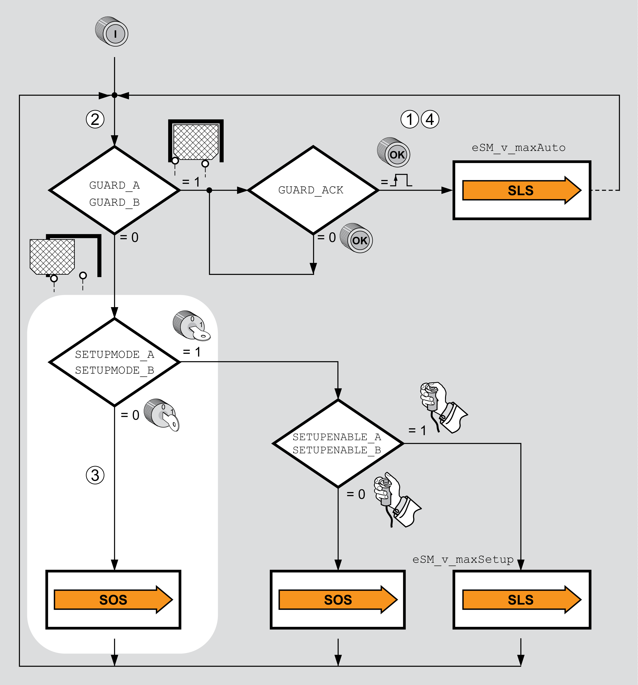

# Safety-Related Function SOS with Open Guard Door

## General

A typical scenario for using the safety-related function SOS in the machine operating mode Automatic Mode includes opening of the guard door during operation of the machine. As long as the guard door is open and access to the zone of operation is possible, the standstill position is monitored with the safety-related function SOS. Regular operation is to be resumed when the guard door is closed again.

Safety-related function SOS with open guard door:

| 1 | The level at the safety-related inputs GUARD\_A and GUARD\_B is 1 (guard door closed). |
| 2 | Opening of the guard door is requested.  The controller must request a deceleration of the movement.  The safety module eSM monitors the deceleration.  The signal INTERLOCK\_OUT releases guard locking of the guard door. |
| 3 | The guard door is open (GUARD\_A, GUARD\_B, SETUPMODE\_A, SETUPMODE\_B: level 0).  The safety-related function SOS is active. |
| 4 | The guard door is closed again. After acknowledgement (GUARD\_ACK), regular operation is resumed with the speed set for machine operating mode Automatic Mode. |

EIO0000004594.00

© 2021

Schneider Electric.

All rights reserved.