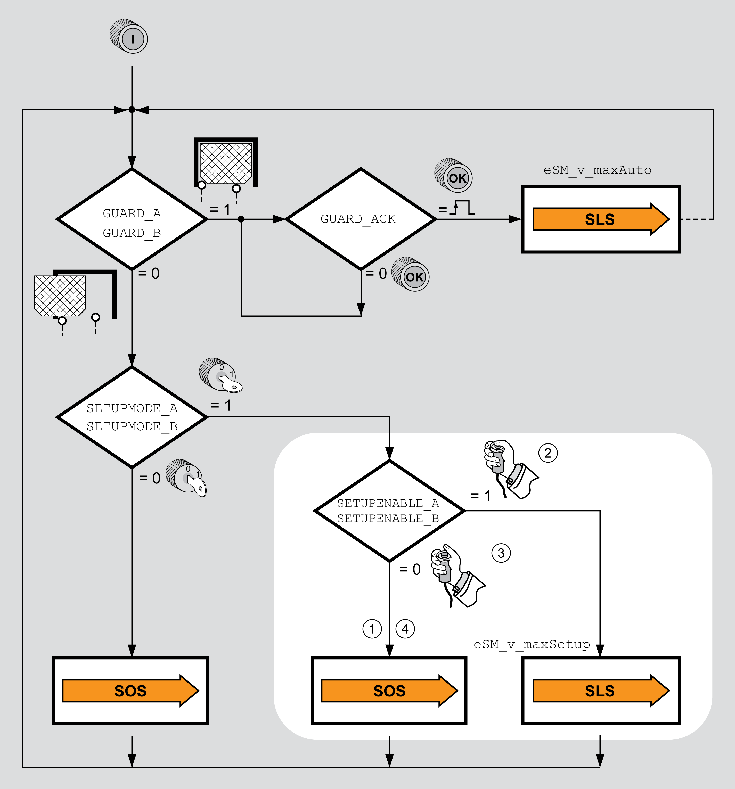

# Safety-Related Function SLS with Open Guard Door

## General Information

A typical scenario for using the safety-related function SLS in the machine operating mode Automatic Mode includes opening of the guard door during operation. As long as the guard door is open and access to the zone of operation is possible, the speed is limited to a specified value with the safety-related function SLS. Regular operation is to be resumed when the guard door is closed again.

Use an enabling device if this is required according to your risk assessment,.

Safety-related function SLS with open guard door:

| Safety-related inputs | Level |
| --- | --- |
| GUARD\_A and GUARD\_B | 0, guard door open |
| SETUPMODE\_A and SETUPMODE\_B | 1, machine operating mode Setup Mode |
| SETUPENABLEE\_A and SETUPENABLEE\_B (enabling device) | 0, safety-related function SOS |
| 1, safety-related function SLS |

| 1 | The enabling device is not active.  The safety-related function SOS is active. |
| 2 | The enabling device is active.  Movement at reduced velocity, monitored by safety-related function SLS. |
| 3 | The enabling device is no longer active.  The master controller must trigger a deceleration of the movement.  The safety module eSM monitors the deceleration. |
| 4 | The enabling device is not active.  The safety-related function SOS is active. |

EIO0000004594.00

© 2021

Schneider Electric.

All rights reserved.