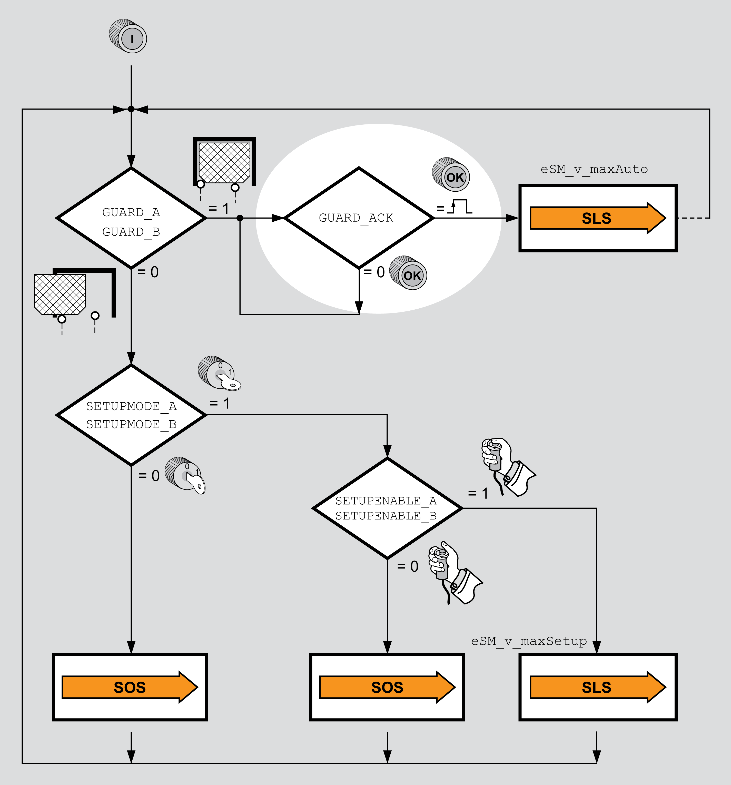

# Acknowledge/Reset Pushbutton

## General

The safety module eSM lets you connect an Acknowledge/Reset pushutton installed outside the zone of operation according to your risk assessment. It acknowledges the safety-related function when the guard door is closed (the level at the inputs Guard\_A and GUARD\_B is 1).

Acknowledge/Reset pushutton:

EIO0000004594.00

© 2021

Schneider Electric.

All rights reserved.