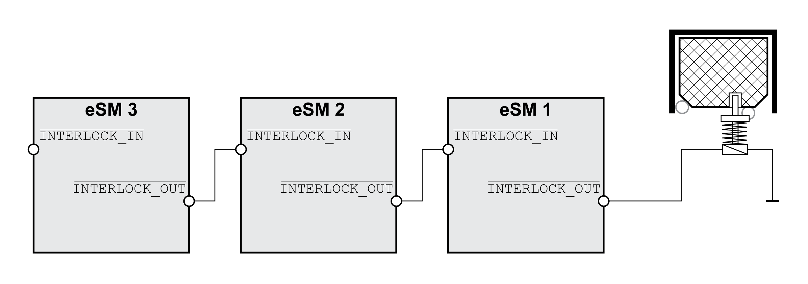

# Guard Door with Guard Locking Device

## General

A guard locking device can be connected to the output INTERLOCK\_OUT of an eSM safety module.

If the velocity is zero, the level at the output INTERLOCK\_OUT of the safety module eSM is 1. Multiple safety modules eSM can be interconnected by chaining the signal of output INTERLOCK\_OUT and the input INTERLOCK\_IN of the next safety module eSM.

Guard locking device and signal chaining:

EIO0000004594.00

© 2021

Schneider Electric.

All rights reserved.