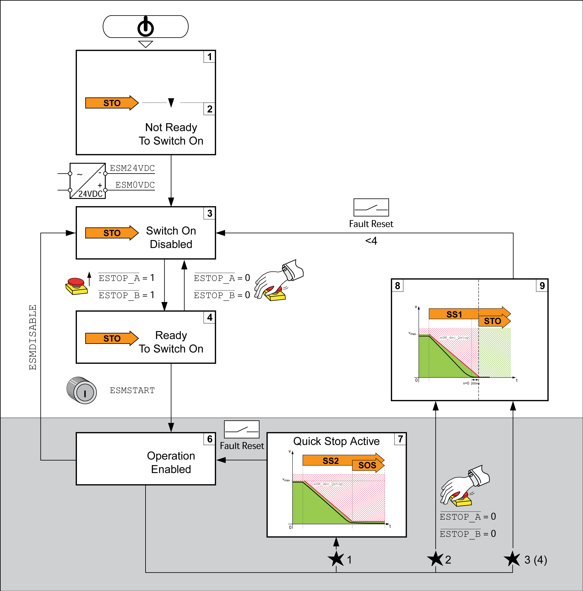

# Operating States and State Transitions

## eSM state diagram

The state diagram of the safety module eSM has the same operating states and state transitions as the state diagram of the drive.

eSM state diagram:

EIO0000004594.00

© 2021

Schneider Electric.

All rights reserved.