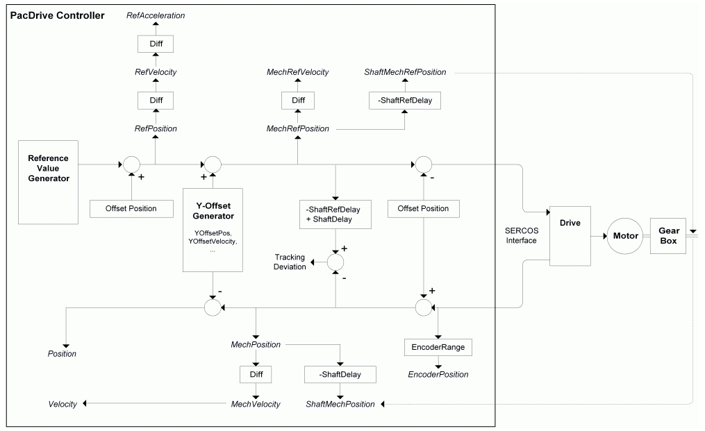

# Parameters Determined by or Derived from Positions

Parameters Determined by or Derived from Positions

The servo amplifier has various position, velocity, and acceleration parameters.

Servo amplifier parameters determined by or derived from positions

In the reference value generator (for example, MasterCam, PosGenerator, ...) the appropriate reference value is calculated using a defined reference value course in every Sercos cycle (CycleTime).

The coordinate system of the reference values can be shifted using SetPos ([FC\_SetposDual()](../../../../../../api/crossBook?lang=en-US&virtualBookName=PD.Lib.SystemInterface&topicID=D_SE_0085315_1), [FC\_SetposGroup()](../../../../../../api/crossBook?lang=en-US&virtualBookName=PD.Lib.SystemInterface&topicID=D_SE_0085317_1), [FC\_SetposSingle()](../../../../../../api/crossBook?lang=en-US&virtualBookName=PD.Lib.SystemInterface&topicID=D_SE_0085319_1)). This shifting is shown in the figure with the quantity OffsetPosition. This quantity is not available for the user. Because this is a shifting of the coordinate system, the reference values that are sent to the drive remain unchanged. To achieve this, the OffsetPosition is deducted. The actual values, which are sent back from the drive, remain unchanged too. However, the unchanged actual value is only displayed in the EncoderPosition. For other actual position values, the OffsetPosition is taken into account.

Values determined by deduction are indicated by Diff. A derived value (for example, RefVelocity) is calculated from the difference between the actual and the previous value of a corresponding value (for example, RefPosition). Thus, there is a dead time (delay) of half a Sercos cycle.

Using the Y offset generator, the reference values can be shifted by the parameterized profile. Further quantities are explained by the respective parameters. The quantities which are given in units are defined on the drive shaft (gear box outgoing side).