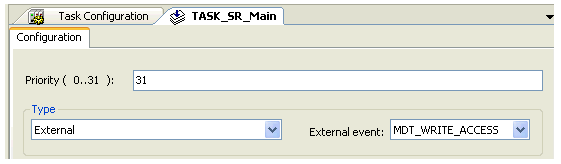

# Restrictions

Restrictions

On tasks of the External type, the consistency of the RefPosition and the position by the calculation of the TrackingDeviation cannot be provided in every case. An additional, not identifiable dead time of a Sercos cycle can occur. This leads to a detected velocity-dependent error. With the setting type External event-driven and External event MDT\_WRITE\_ACCESS, the system helps to have a consistent access and provides an accurate value for the TrackingDeviation.

NOTE: The parameter value is calculated in dependency of the parameters that are transferred from the slave to the master via the real-time channel of the Sercos. If the Sercos bus is not in phase 4, then a standard value is indicated here. If the Sercos bus is in phase 4 (operating phase), then the parameter value is calculated and indicated. This parameter has no meaning for asynchronous motors without encoder (in open-loop V / f control mode, [ControlMode](../ControlLoop_2/ControlLoop_2-2.htm#XREF_D_SE_0071561_1) = open-loop control / 1).