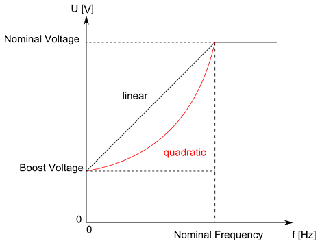

# Functional Description

Functional Description

This parameter determines the voltage boost in the low range of rotation speeds. The output voltage is proportional to the speed of rotation in the open-loop controlled operation. In the low range of rotation speeds, the voltage must, however, be large enough in order to provide a sufficiently large current flow in comparison to the winding resistance of the motor. Therefore the output voltage is raised to a predefined value when it is lower than a specific minimum value. This value is determined through the BootVoltage parameter. If the voltage boost is not high enough, it is possible that the motor does not move with a lower desired speed of rotation. Too high a voltage boost leads to a high flow of current at a low speed of rotation.

This parameter is only used in closed-loop controlled operation (see [ControlMode](ControlLoop_2-2.htm#XREF_D_SE_0071561_1) has the value open-loop control / 1).

NOTE: The parameter value is transferred from the master to the slave via the parameter channel of the Sercos at every access. Typically, this takes about 10 ms. However, times up to 1 s can occur if there is a lot of data transferred on the parameter channel.