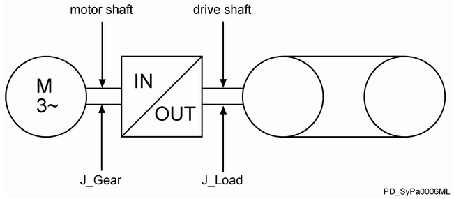

# Functional Description

Functional Description

Is used to enter the feed constant. The feed constant defines in which units the position information is calculated. As units, for example, millimeters, degrees, and inches can be defined. The defined unit is also used for velocity (Velocity in unit/s) and acceleration (Acceleration in units/s2).

The feed constant is the path (in units) which was covered by one rotation of the drive shaft.

NOTE: Modifications to the parameter are only applied during the Sercos phase up (communication phase 0 => communication phase 4).

Parameters GearIn and GearOut of the drive

