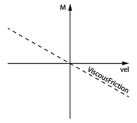

# Functional Description

Functional Description

Is used to enter the viscous rotation direction-dependent friction on the drive shaft (gear box output side) in Newton meter per 1000 units per second [Nm / (1000 units/s)]. The viscous friction is a moment that changes proportionally to the reference velocity at the drive shaft and works in the opposite direction of the motor velocity.

NOTE: The parameter is supported from V1.33.xx.00.

Effect of ViscousFriction

NOTE: The parameter value is transferred from the master to the slave via the parameter channel of the Sercos at every access. Typically, this takes about 10 ms. However, times up to 1 s can occur if there is a lot of data transferred on the parameter channel.

NOTE: This parameter can be determined as of firmware version V01.35.x.0 by using the AutoTune automatic controller optimization.

This parameter has no effect for asynchronous motors in open-loop V / f mode ([ControlMode](../ControlLoop_2/ControlLoop_2-2.htm#XREF_D_SE_0071561_1) = open-loop control / 1).