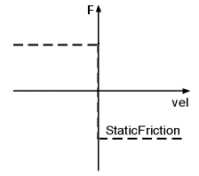

# Functional Description

Functional Description

Is used to enter the static direction-dependent friction from the motor and load in Newton [N].

The static friction is a constant force that works in the opposite direction of the motor movement. At standstill, this force is zero. The state of StaticFriction depends on the reference velocity.

NOTE: The parameter value is transferred from the master to the slave via the parameter channel of the Sercos at every access. Typically, this takes about 10 ms. However, times up to 1 s can occur if there is a lot of data transferred on the parameter channel.

NOTE: This parameter can be determined as of firmware version V01.35.x.0 by using the AutoTune automatic controller optimization.