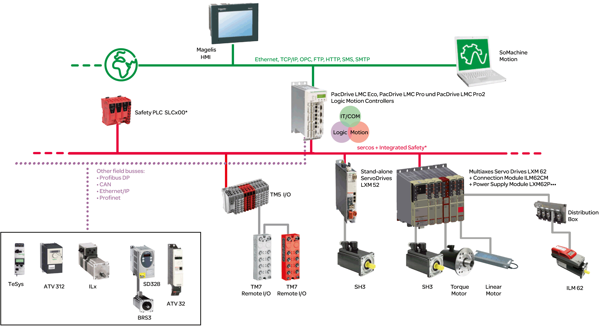

# System Overview

System Overview

The control system consists of several components, depending on its application.

PacDrive 3 system overview

\*   Safety Logic Controller according to IEC 61508:2010 and EN ISO 13849:2008