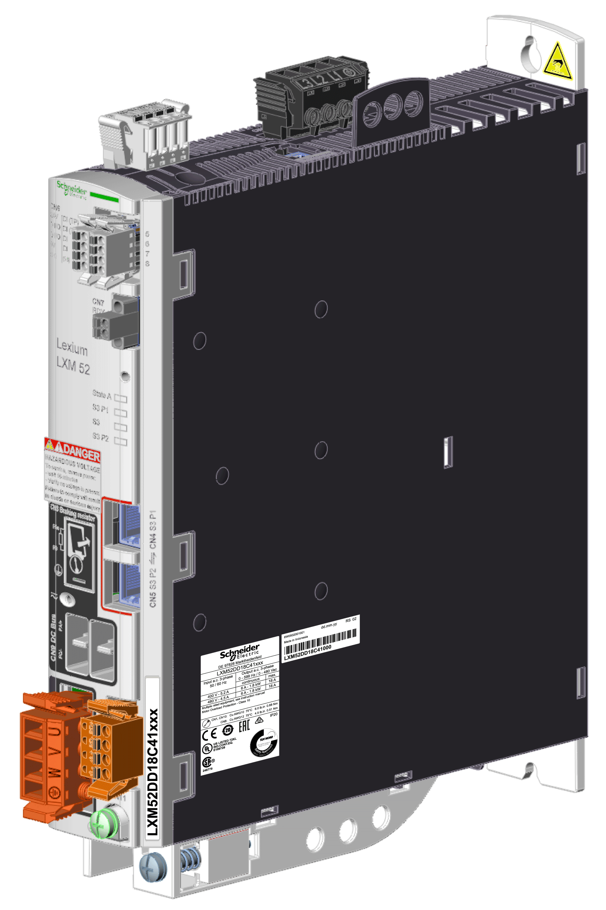
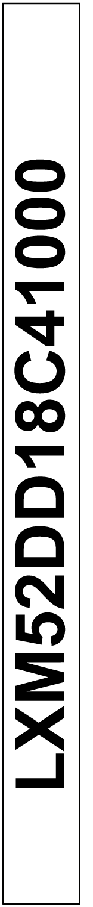

# Overview

Overview

The technical nameplates are located laterally on the housing:

Explanation of the technical nameplate entries:

| Label | Description |
| --- | --- |
| LXM52xxxxxxxxxx | Device type and Unicode |
| Input AC | Input voltage and input current (rated and peak value per input) |
| Output | Output voltage and output current (rated and peak value per output) |
| IP20 | Degree of protection |
| RS:01 | Hardware revision (1) |
| D.O.M. | Date of manufacture in day-month-year format |
| (1)   When replacing the device, the hardware revision for the previous and the new device should be identical to help avoid potential compatibility issues with the equipment. | |

The logistical nameplate is located on top of the housing.

