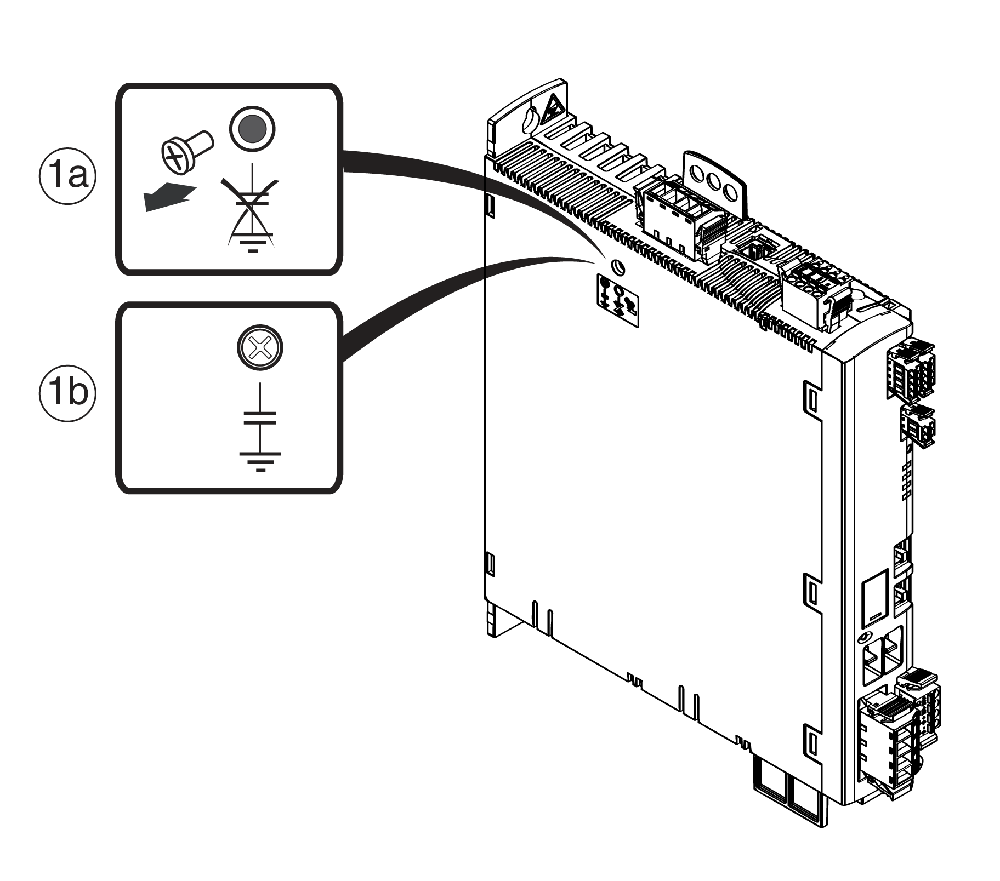

# Deactivating the Y Capacitors

Deactivating the Y Capacitors

The grounding of the internal Y capacitors can be undone (disabled). Usually, it is not required to undo the grounding of the Y capacitors.

Screw location for deactivating/activating the internal Y capacitors:

To deactivate the Y capacitors, remove the screw, see figure above. Keep this screw so you can reactivate the Y capacitors, if necessary.

NOTE: If the Y capacitors are disabled, the specified EMC characteristics no longer apply.