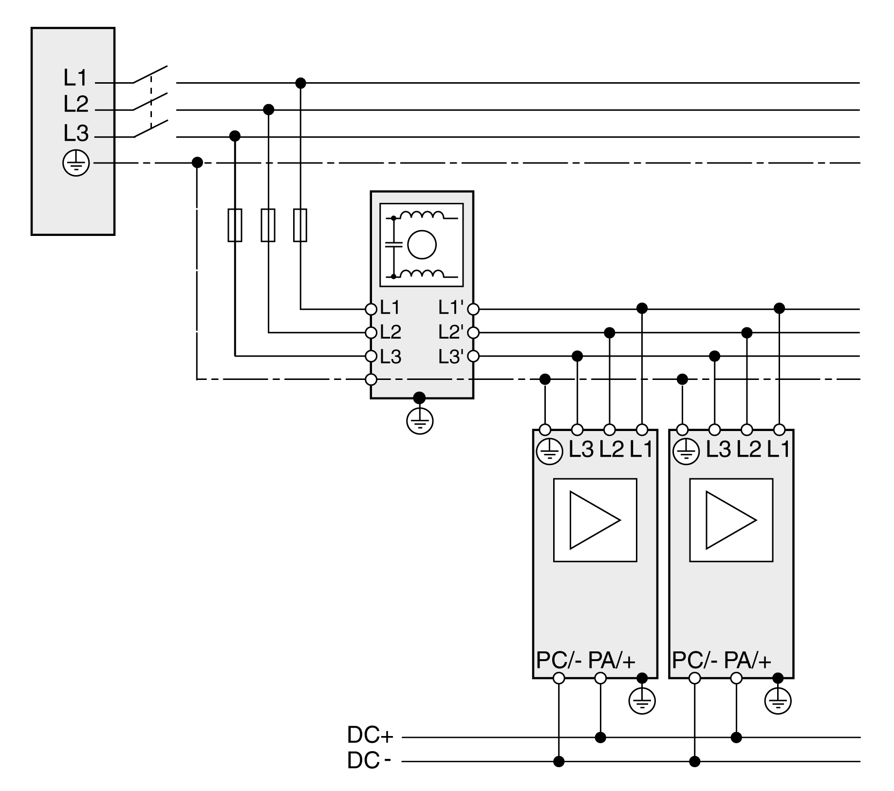

# Mains Filter

Mains Filter

The emission depends on the length of the motor cables. If the required limit value is not reached with the internal mains filter, you must use an external mains filter.

Observe the [limit values](LXM52HW_LXM62HW_Engineering-15.htm#XREF_D_SE_0051303_2) for the mains filter.

The mains filter for several drives with a common AC fuse must be rated in such a way that the nominal current of the external mains filter is greater than the total of the input current of the drives.

The fuse rating of the fuse upstream of the external mains filter must not be greater than the nominal current of the external mains filter.

Mount the external mains filter in such a way that the lines from the mains filter to the drives are as short as possible. For EMC ([Electromagnetic Compatibility](LXM52HW_LXM62HW_Engineering-2.htm#XREF_D_SE_0051291_1)) reasons, route the cables from the mains filter to the drives separately from the line to the mains filter.

External three-phase mains filters do not have a neutral conductor connection; they are only approved for three-phase devices.

The following graphic shows the wiring of an external mains filter (example shows three-phase drives):

