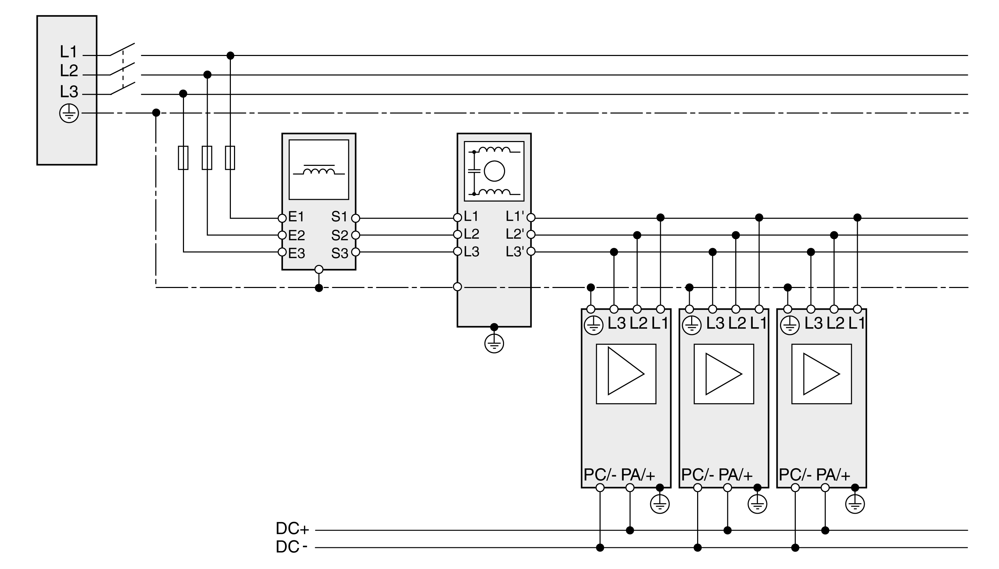

# Mains Line Reactor and External Mains Filter

Mains Line Reactor and External Mains Filter

If a mains line reactor and an external mains line reactor are required, the mains line reactor and external mains filter must be arranged according to the following illustrations for EMC reasons.

The following graphic shows the wiring of drives with common mains fuse, mains line reactor, and mains filter (example shows three-phase drives):

