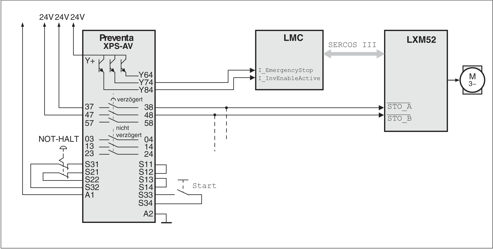

# Operating Principle

Operating Principle

The safety function Inverter Enable is triggered via 2 redundant inputs. In order to maintain the dual-channel design, both inputs must be switched individually. The switching operation must take place for both inputs simultaneously (time offset <1 s). The power stage is being disabled. The motor can no longer generate a torque. If only one of both inputs is disabled or the time offset is too long, the power stage is disabled and a detected error message is issued.

oAfter the emergency stop device is activated, a controlled ramp down takes place for the drive.

oIn the process, the DC bus voltage increases until the braking resistor is switched on.

oIn the braking resistor, the energy which is fed back from the motor is converted to heat.

oThe power circuit breaker and/or the Inverter Enable signal must remain energized until the drive stops.

oAt the latest after the normal braking time, the Inverter Enable signal is switched off by the delayed contacts of the safety POU PREVENTA XPS-AV.

oAfter this, the drive is in a defined safe stop.

Example stop category 1 with external EMERGENCY STOP safety POU Preventa XPS-AV

