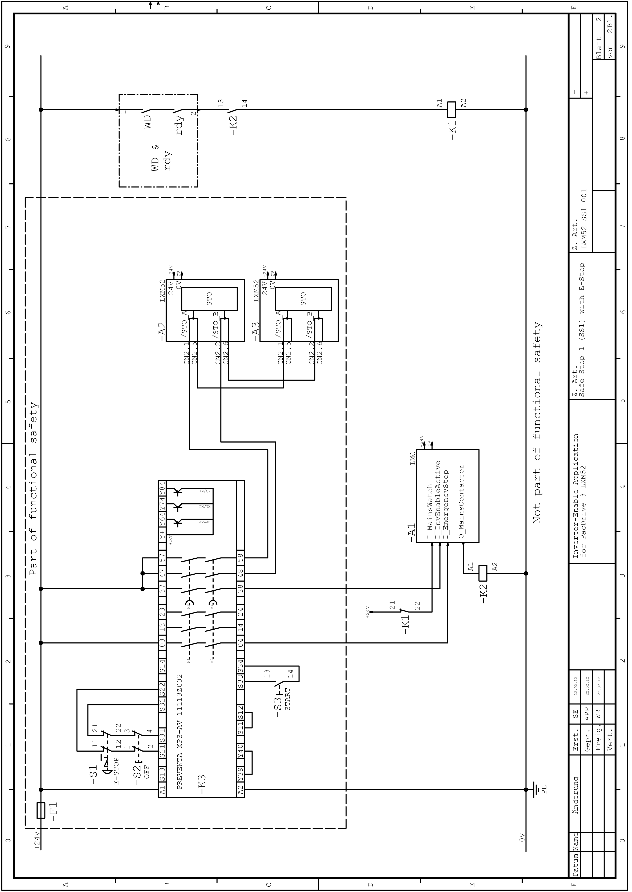

# Notes on Application Proposals - Notes to LXM52-SS1-001

Notes on Application Proposals - Notes to LXM52-SS1-001

The mains contactor K1 in this circuit proposal is not necessary for functional safety purposes. It is, however, used in the application proposal for the device protection.

Application proposal for the control circuit (drawing number LXM52-SS1-001)

Application proposal for the load cycle (drawing number LXM52-SS1-001)

