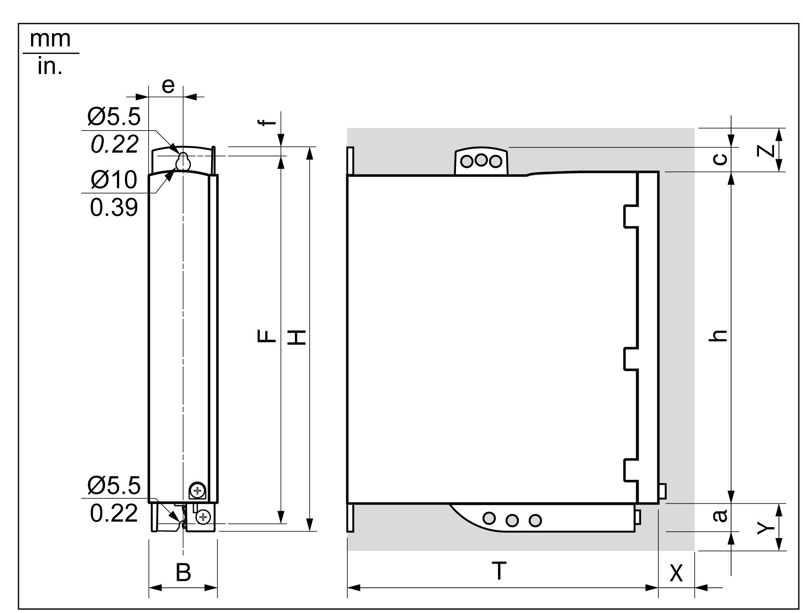
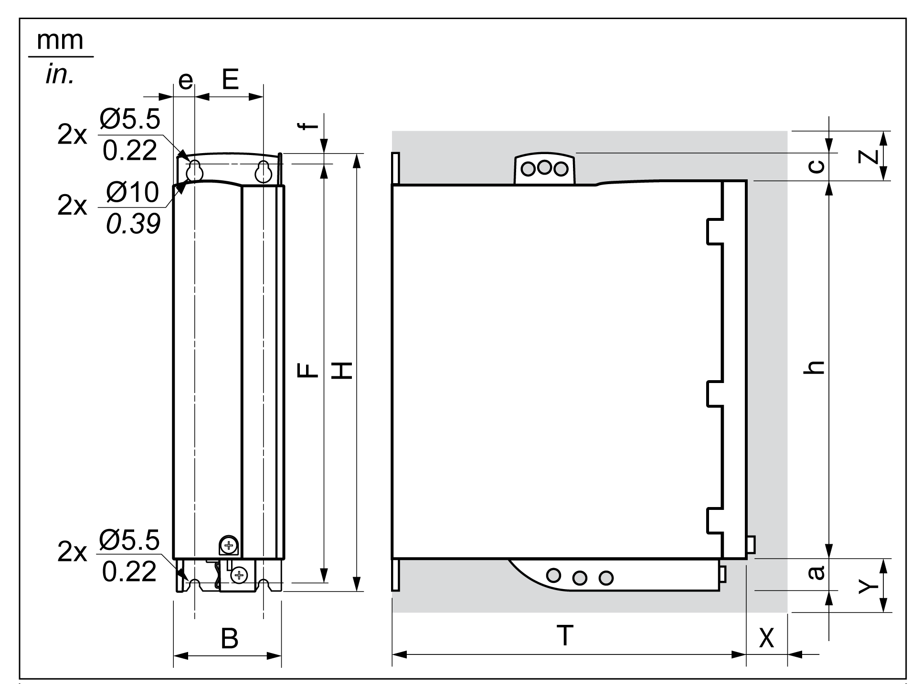

# Dimensions for the Mounting Hole

Dimensions for the Mounting Hole

| Step | Action |
| --- | --- |
| 1 | Take the dimensions from the dimensional drawings in order to calculate the distances between several devices. |
| 2 | Observe tolerances as well as distances to the cable channels and adjacent control cabinet series. |

Dimensional drawing 1

Dimensional drawing 2

Dimensions

| Parameter | Value | | | |
| --- | --- | --- | --- | --- |
| Lexium 52... | U60 | D12  D18 | D30 | D72 |
| Figure | Dimensional drawing 1 | Dimensional drawing 1 | Dimensional drawing 2 | Dimensional drawing 2 |
| B | 48 ±1 mm (1.89 ±0.04 in) | | 68 ±1 mm (1.89 ±0.04 in) | 108 ±1 mm (1.89 ±0.04 in) |
| T | 225 mm (8.86 in) | | | |
| H | 270 mm (10.63 in) | | | 274 mm (10.79 in) |
| e | 24 mm (0.94 in) | | 13 mm (0.51 in) | |
| E | – | | 42 mm (1.65 in) | 82 mm (3.23 in) |
| F | 258 mm (10.16 in) | | | |
| f | 7.5 mm (0.30 in) | | | |
| a | 20 mm (0.79 in) | | | 24 mm (0.95 in) |
| h | 230 mm (9.06 in) | | | |
| c | 20 mm (0.79 in) | | | |
| X required clearance | 60 mm (2.36 in) | | | |
| Y required clearance | 100 mm (3.94 in) | | | |
| Z required clearance | 100 mm (3.94 in) | | | |
| Cooling type | Convection (1) | Fan 40 mm (1.57 in) | Fan 60 mm (2.36 in) | Fan 80 mm (3.15 in) |
| (1) >1 m/s | | | | |

The connection cables of the device have to lead upward and downward.

In order to ensure sufficient air circulation and a cable routing without kinks, the following distances must be kept:

oAt least 100 mm (3.94 in) of clearance are required above the device.

oAt least 100 mm (3.94 in) of clearance are required below the device.

oAt least 60 mm (2.36 in) of clearance are required in front of the device.