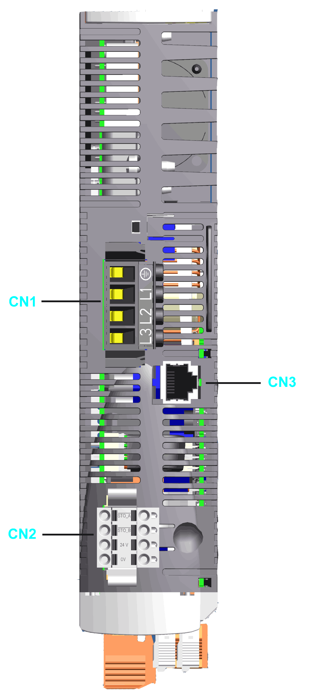

# Top Side

Top Side

| Connection | Meaning | Connection cross-section [mm2] / [AWG] | Tightening torque [Nm] / [lbf in] |
| --- | --- | --- | --- |
| CN1 | Mains connection | 0.75...5.3 / 18...10(1) | 0.68 / 6.0 |
| 0.75...10 / 18...8(2) | 1.81 / 16.02 |
| CN2 | 24 V control supply and safety function STO | 0.5...2.5 / 20...14 | – |
| CN3 | Motor encoder | – | – |
| (1) These values apply to LXM52DU60C, LXM52DD12C, LXM52DD18C, LXM52DD30C.  (2) These values apply to LXM52DD72C. | | | |