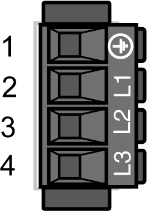

# CN1 - Mains Connection (Power Stage Supply)

CN1 - Mains Connection (Power Stage Supply)

The Lexium 52 is supplied with voltage via the power connection. The rated voltage is 208...480 V.

Electrical connection - mains connection (power stage supply)

| Pin | Designation | Meaning |
| --- | --- | --- |
| 1 | G-SE-0004529.2.gif-high.gif | Protective ground conductor |
| 2 | L1 | External conductor L1 |
| 3 | L2 | External conductor L2 |
| 4 | L3 | External conductor L3 |