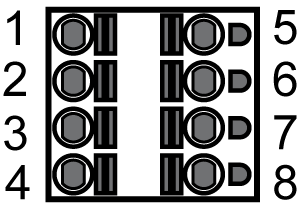

# CN2 - Connection for 24 V Control Supply and Safety Function STO

CN2 - Connection for 24 V Control Supply and Safety Function STO

The 24 V input supplies the internal logic assemblies as well as the holding brakes of the complete axis group, connected to the axis modules.

CN2 Connection for 24 V control supply and safety function STO

| Pin | Designation | Meaning |
| --- | --- | --- |
| 1 | STO\_A | InverterEnable signal A |
| 2 | STO\_B | InverterEnable signal B |
| 3 | 24 V | Supply voltage Lexium 52 - Input |
| 4 | 0V | Supply voltage Lexium 52 - Input |
| 5 | STO\_A | Inverter enable signal A, jumpered with pin 1 |
| 6 | STO\_B | Inverter enable signal B, jumpered with pin 2 |
| 7 | 24 V | Supply voltage for optional external holding brake - output, jumpered with pin 3. |
| 8 | 0V | Supply voltage for optional external holding brake - output, jumpered with pin 4. |

NOTE: The maximum terminal current is 16 A. Note the maximum permissible terminal current when connecting several Lexium 52.