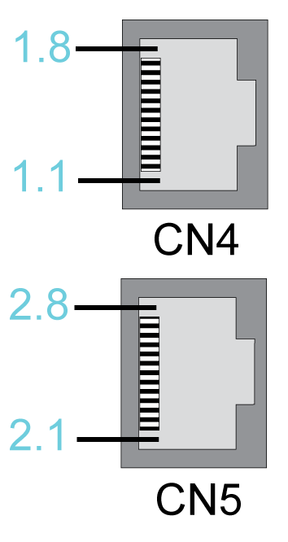

# CN4/CN5 - Sercos

CN4/CN5 - Sercos

The Sercos connection is used for communication between the controller and the drive.

Electrical connection - Sercos

| Pin | Designation | Meaning |
| --- | --- | --- |
| 1.1 | Eth0\_Tx+ | Positive transmission signal |
| 1.2 | Eth0\_Tx- | Negative transmission signal |
| 1.3 | Eth0\_Rx+ | Positive receiver signal |
| 1.4 | N.C. | Reserved |
| 1.5 | N.C. | Reserved |
| 1.6 | Eth0\_Rx- | Negative receiver signal |
| 1.7 | N.C. | Reserved |
| 1.8 | N.C. | Reserved |
| 2.1 | Eth1\_Tx+ | Positive transmission signal |
| 2.2 | Eth1\_Tx- | Negative transmission signal |
| 2.3 | Eth1\_Rx+ | Positive receiver signal |
| 2.4 | N.C. | Reserved |
| 2.5 | N.C. | Reserved |
| 2.6 | Eth1\_Rx- | Negative receiver signal |
| 2.7 | N.C. | Reserved |
| 2.8 | N.C. | Reserved |