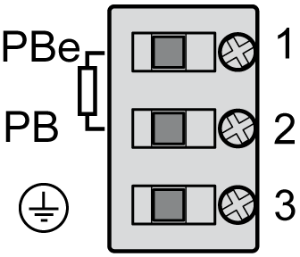

# CN8 - Connection External Braking Resistor

CN8 - Connection External Braking Resistor

If the internal braking resistor is not sufficient, you can connect an external braking resistor to this connection.

Electrical connection - external braking resistor

| Pin | Designation | Meaning |
| --- | --- | --- |
| 1 | PBe | Connection for external resistor |
| 2 | PB | Connection for external resistor |
| 3 | G-SE-0004529.2.gif-high.gif | Protective ground conductor |

For further information, refer to:

oThe [technical data specified for external braking resistors](../LMC100HW_Technical_Data/LMC100HW_Technical_Data-4.htm#XREF_D_SE_0051520_2).

oThe configuration of parameters within the parameter group ExternalBrakingResistor in EcoStruxure Machine Expert. (See the EcoStruxure Machine Expert Online Help, section Drive Systems and Motors --> Lexium 52 stand-alone drive system and motors --> Lexium 52 device objects and parameters -->Lexium LXM52 Drive --> External Braking Resistor.)

oFor further information about the available external braking resistors see catalogue "PacDrive 3 automation solution Lexium 52 stand-alone servo drive" at Schneider Electric website.