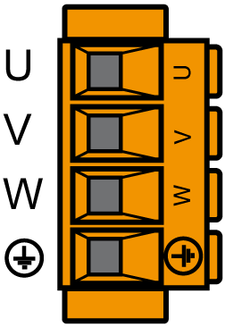

# CN10 - Connection for the Motor Phases

CN10 - Connection for the Motor Phases

The motor signals U, V, and W supply the motor with the required energy.

Electrical connection - holding brake motor, temperature motor

| Motor cable(1) | | Motor connectors | Meaning |
| --- | --- | --- | --- |
| Label of cable core | Color of cable core | Label |
| 1 | Black | U | Motor phase U |
| 2 | Black | V | Motor phase V |
| 3 | Black | W | Motor phase W |
| – | Green/Yellow | G-SE-0004529.2.gif-high.gif | Protective conductor protective earth ground |
| (1) Order numbers: VW3E1143Rxxx, VW3E1144Rxxx, VW3E1145Rxxx | | | |

The insulation-stripped length of the wires of the motor connector is 15 mm (0.59 in.). The maximum length of the motor supply cable is 75 m (246.06 ft).