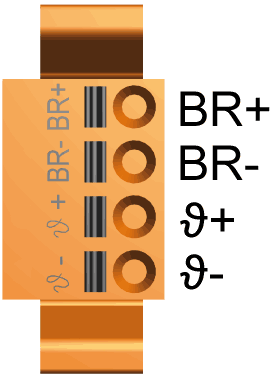

# CN11 - Holding Brake Motor, Temperature Motor

CN11 - Holding Brake Motor, Temperature Motor

The temperature signals are connected to a temperature sensor to measure the temperature of the motor. The holding brake output supplies the holding brake in the motor with the required energy.

The device monitors the motor phases for:

oShort circuit between the motor phases.

oShort circuit between the motor phases and ground.

Short circuits between the motor phases and the DC bus, the braking resistor, or the holding brake wires are not detected.

Electrical connection - motor phases

| Motor cable(1) | | Motor connectors | Meaning |
| --- | --- | --- | --- |
| Label of cable core | Color of cable core | Label |
| 5 | Black | 1  ϑ− | Temperature negative signal |
| 6 | Black | ϑ+ | Temperature positive signal |
| 7 | Black | BR- | Holding brake negative connection (2) |
| 8 | Black | BR+ | Holding brake positive connection (2) |
| (1) Order numbers: VW3E1143Rxxx, VW3E1144Rxxx, VW3E1145Rxxx  (2) The maximum terminal current is 1.7 A. | | | |

The insulation-stripped length of the wires of the motor connector is 15 mm (0.59 in.). The maximum length of the motor supply cable is 75 m (246.06 ft).