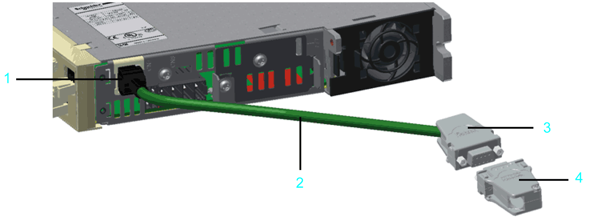

# General Information

General Information

5V Encoder Adapter

1   RJ45 connector

2   Encoder cables

3   D-Sub 9-pin female connector

4   D-Sub 9-pin male connector at the encoder cable (user furnished)