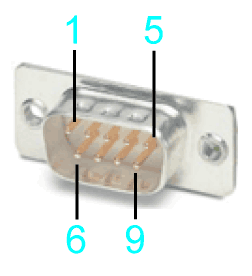
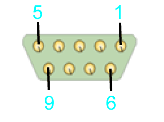

# D-Sub 9-Pin Male Connector - Encoder Cable Pre-Assembled by the Customer

D-Sub 9-Pin Male Connector - Encoder Cable Pre-Assembled by the Customer

View mating side

View soldering side

Electrical connection D-Sub 9-pin male connector

| Pin | Designation | Description | Range |
| --- | --- | --- | --- |
| 1 | SIN | Positive sine signal | 1 Vpp ±0.1 V |
| 2 | Ref\_Sin | Negative sine signal | Offset 2.5 ±0.3 V |
| 3 | COS | Positive cosine signal | 1 Vpp ±0.1 V |
| 4 | Ref\_Cos | Negative cosine signal | Offset 2.5 ±0.3 V |
| 5 | N.C. | Reserved | – |
| 6 | P5V | 5 V encoder supply voltage | 5 V ±1% / Iout\_max=250 mA |
| 7 | P10V | 10 V encoder supply voltage | 10 V ±5% / Iout\_max=125 mA |
| 8 | N.C. | Reserved | – |
| 9 | GND | Encoder return | 0 V |