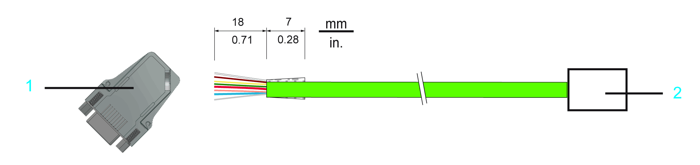
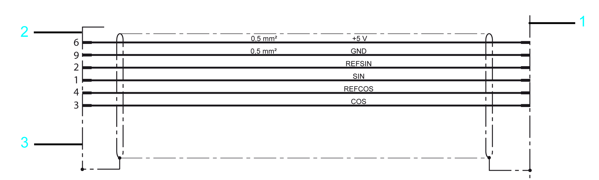

# Encoder Cable

Encoder Cable

Connection of D-Sub 9-pin male connectors at the encoder cable (user furnished):

1   D-Sub 9-pin male connector at the encoder cable

2   Encoder connector

Cable configuration of encoder cable

1   Encoder connector

2   D-Sub 9-pin male connector at the encoder cable

3   Metal housing

Maximum encoder cable length

| Connection cross section [mm2] / [AWG] | Current consumption [A] | Maximum encoder cable length [m] / [ft] |
| --- | --- | --- |
| 0.5 / 20 | 0.05 | 58 / 190.3 |
| 0.07 | 41 / 134.5 |
| 0.10 | 29 / 95.1 |
| 0.12 | 24 / 78.7 |
| 0.18 | 16 / 52.5 |
| 0.24 | 12 / 39.4 |