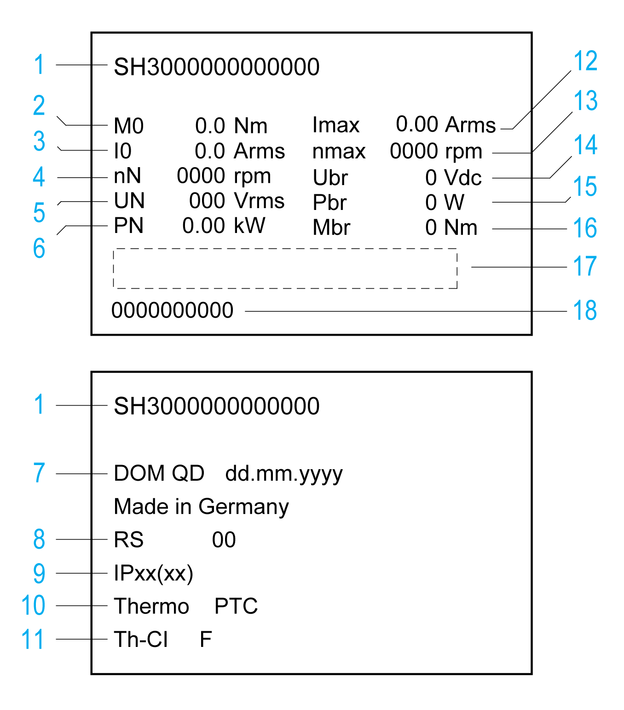
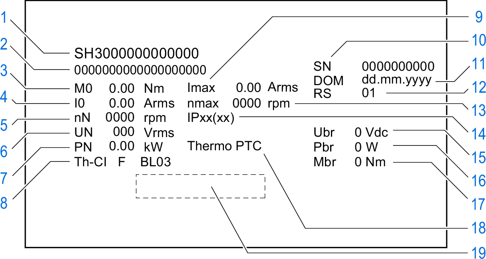

# Nameplate

## SH3040

The nameplate contains the following data:

| 1 | Commercial reference, see [Type Code](D-SE-0061817.html#D-SE-0061817) |
| 2 | Continuous stall torque |
| 3 | Continuous stall current |
| 4 | Nominal speed of rotation |
| 5 | Maximum nominal value of supply voltage |
| 6 | Nominal power |
| 7 | Date of manufacture |
| 8 | Hardware version |
| 9 | Degree of protection (housing without shaft bushing) |
| 10 | Temperature sensor |
| 11 | Thermal class |
| 12 | Maximum current |
| 13 | Maximum speed of rotation |
| 14 | Nominal voltage of holding brake |
| 15 | Nominal power (electrical ‌pull-in power) of holding brake |
| 16 | Holding torque of holding brake |
| 17 | Barcode |
| 18 | Serial number |

## SH3055 ... SH3205

The nameplate contains the following data:

| 1 | Commercial reference, see [Type Code](D-SE-0061817.html#D-SE-0061817) |
| 2 | Identification number |
| 3 | Continuous stall torque |
| 4 | Continuous stall current |
| 5 | Nominal speed of rotation |
| 6 | Maximum nominal value of supply voltage |
| 7 | Nominal power |
| 8 | Thermal class |
| 9 | Maximum Current |
| 10 | Serial number |
| 11 | Date of manufacture |
| 12 | Hardware version |
| 13 | Maximum speed of rotation |
| 14 | Degree of protection (housing without shaft bushing) |
| 15 | Nominal voltage of holding brake |
| 16 | Nominal power (electrical ‌pull-in power) of holding brake |
| 17 | Holding torque of holding brake |
| 18 | Temperature sensor |
| 19 | Barcode |

0198441113987.08