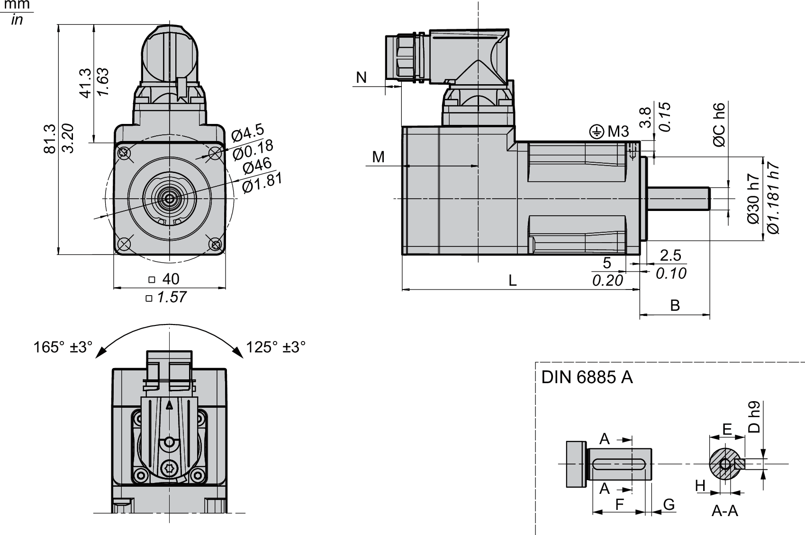
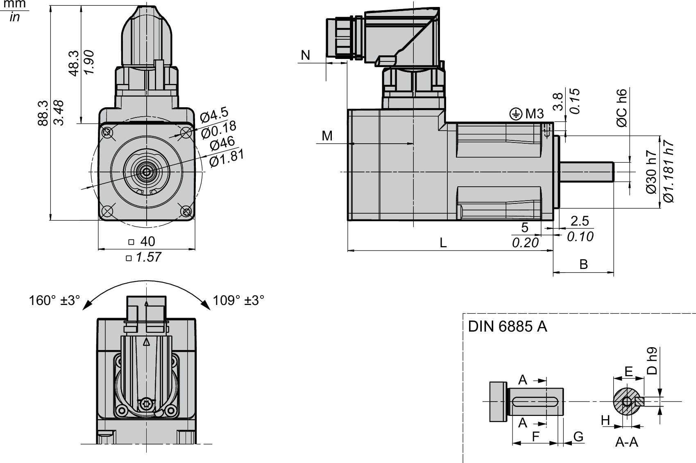
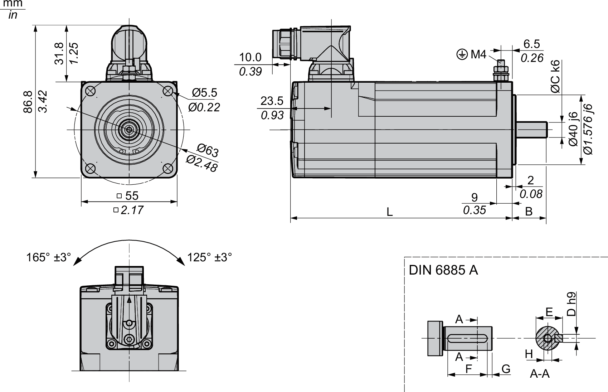
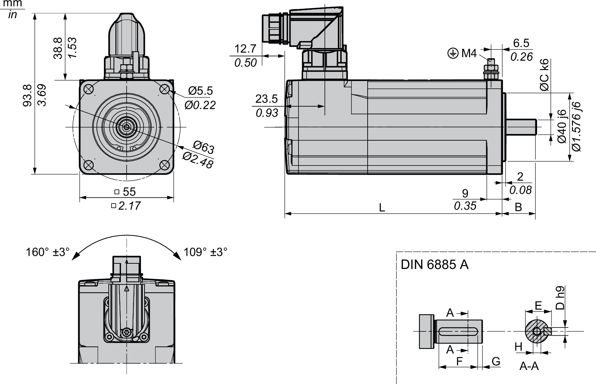
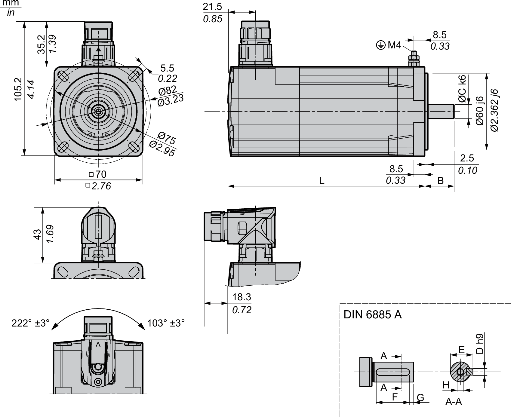
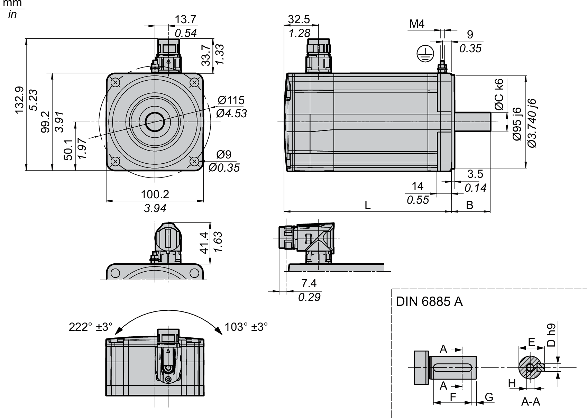
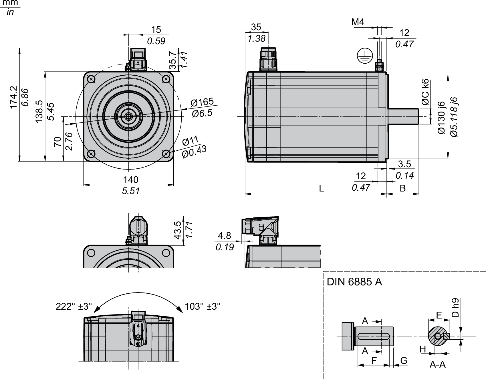
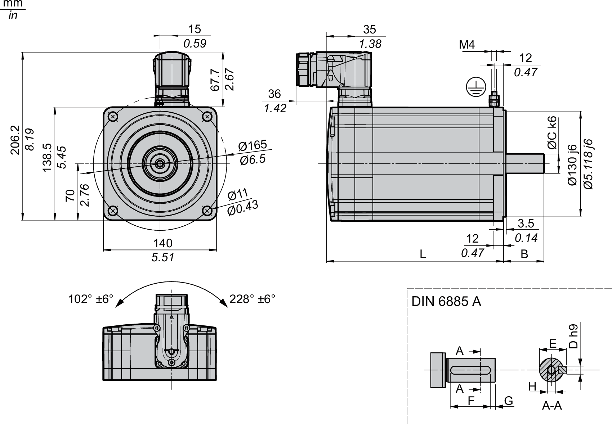

# Dimensions for Motors with One-Cable Connection

## SH3040

Dimensions with hardware version ≥RS02:

| Characteristic | | Unit | Value | |
| --- | --- | --- | --- | --- |
| SH30401 | SH30402 |
| **L** | Length without holding brake | mm (in) | 84.9 (3.34) | 104.9 (4.13) |
| **L** | Length with holding brake | mm (in) | 110.9 (4.37) | 130.9 (5.15) |
| **M** | Distance without holding brake | mm (in) | 27.4 (1.08) | 27.4 (1.08) |
| **M** | Distance with holding brake | mm (in) | 35.9 (1.41) | 35.9 (1.41) |
| **N** | Distance without holding brake | mm (in) | 6 (0.24) | 6 (0.24) |
| **N** | Distance with holding brake | mm (in) | -2.5 (-0.1) | -2.5 (-0.1) |
| **B** | Shaft length | mm (in) | 25 (0.98) | 25 (0.98) |
| **C** | Shaft diameter | mm (in) | 8 (0.31) | 8 (0.31) |
| **D** | Width of parallel key | mm (in) | 3 (0.12) | 3 (0.12) |
| **E** | Shaft width with parallel key | mm (in) | 9.2 (0.36) | 9.2 (0.36) |
| **F** | Length of parallel key | mm (in) | 12 (0.47) | 12 (0.47) |
| **G** | Distance parallel key to shaft end | mm (in) | 4 (0.16) | 4 (0.16) |
| **H** | Female thread of shaft |  | DIN 332 DS M3 x 9 | DIN 332 DS M3 x 9 |
|  | Parallel key |  | DIN 6885-A3x3x12 | DIN 6885-A3x3x12 |

Dimensions with hardware version <RS02:

| Characteristic | | Unit | Value | |
| --- | --- | --- | --- | --- |
| SH30401 | SH30402 |
| **L** | Length without holding brake | mm (in) | 84.9 (3.34) | 104.9 (4.13) |
| **L** | Length with holding brake | mm (in) | 110.9 (4.37) | 130.9 (5.15) |
| **M** | Distance without holding brake | mm (in) | 27.4 (1.08) | 27.4 (1.08) |
| **M** | Distance with holding brake | mm (in) | 35.9 (1.41) | 35.9 (1.41) |
| **N** | Distance without holding brake | mm (in) | 8.9 (0.35) | 8.9 (0.35) |
| **N** | Distance with holding brake | mm (in) | 0.4 (0.02) | 0.4 (0.02) |
| **B** | Shaft length | mm (in) | 25 (0.98) | 25 (0.98) |
| **C** | Shaft diameter | mm (in) | 8 (0.31) | 8 (0.31) |
| **D** | Width of parallel key | mm (in) | 3 (0.12) | 3 (0.12) |
| **E** | Shaft width with parallel key | mm (in) | 9.2 (0.36) | 9.2 (0.36) |
| **F** | Length of parallel key | mm (in) | 12 (0.47) | 12 (0.47) |
| **G** | Distance parallel key to shaft end | mm (in) | 4 (0.16) | 4 (0.16) |
| **H** | Female thread of shaft |  | DIN 332 DS M3 x 9 | DIN 332 DS M3 x 9 |
|  | Parallel key |  | DIN 6885-A3x3x12 | DIN 6885-A3x3x12 |

## SH3055

Dimensions with hardware version ≥RS02:

| Characteristic | | Unit | Value | | |
| --- | --- | --- | --- | --- | --- |
| SH30551 | SH30552 | SH30553 |
| **L** | Length without holding brake | mm (in) | 132.5 (5.22) | 154.5 (6.08) | 176.5 (6.95) |
| **L** | Length with holding brake | mm (in) | 159 (6.26) | 181 (7.13) | 203 (7.99) |
| **B** | Shaft length | mm (in) | 20 (0.79) | 20 (0.79) | 20 (0.79) |
| **C** | Shaft diameter | mm (in) | 9 (0.35) | 9 (0.35) | 9 (0.35) |
| **D** | Width of parallel key | mm (in) | 3 (0.12) | 3 (0.12) | 3 (0.12) |
| **E** | Shaft width with parallel key | mm (in) | 10.2 (0.4) | 10.2 (0.4) | 10.2 (0.4) |
| **F** | Length of parallel key | mm (in) | 12 (0.47) | 12 (0.47) | 12 (0.47) |
| **G** | Distance parallel key to shaft end | mm (in) | 4 (0.16) | 4 (0.16) | 4 (0.16) |
| **H** | Female thread of shaft |  | DIN 332-D M3 | DIN 332-D M3 | DIN 332-D M3 |
|  | Parallel key |  | DIN 6885-A3x3x12 | DIN 6885-A3x3x12 | DIN 6885-A3x3x12 |

Dimensions with hardware version <RS02:

| Characteristic | | Unit | Value | | |
| --- | --- | --- | --- | --- | --- |
| SH30551 | SH30552 | SH30553 |
| **L** | Length without holding brake | mm (in) | 132.5 (5.22) | 154.5 (6.08) | 176.5 (6.95) |
| **L** | Length with holding brake | mm (in) | 159 (6.26) | 181 (7.13) | 203 (7.99) |
| **B** | Shaft length | mm (in) | 20 (0.79) | 20 (0.79) | 20 (0.79) |
| **C** | Shaft diameter | mm (in) | 9 (0.35) | 9 (0.35) | 9 (0.35) |
| **D** | Width of parallel key | mm (in) | 3 (0.12) | 3 (0.12) | 3 (0.12) |
| **E** | Shaft width with parallel key | mm (in) | 10.2 (0.4) | 10.2 (0.4) | 10.2 (0.4) |
| **F** | Length of parallel key | mm (in) | 12 (0.47) | 12 (0.47) | 12 (0.47) |
| **G** | Distance parallel key to shaft end | mm (in) | 4 (0.16) | 4 (0.16) | 4 (0.16) |
| **H** | Female thread of shaft |  | DIN 332-D M3 | DIN 332-D M3 | DIN 332-D M3 |
|  | Parallel key |  | DIN 6885-A3x3x12 | DIN 6885-A3x3x12 | DIN 6885-A3x3x12 |

## SH3070

| Characteristic | | Unit | Value | | |
| --- | --- | --- | --- | --- | --- |
| SH30701 | SH30702 | SH30703 |
| **L** | Length without holding brake | mm (in) | 154 (6.06) | 187 (7.36) | 220 (8.66) |
| **L** | Length with holding brake | mm (in) | 180 (7.09) | 213 (8.39) | 246 (9.69) |
| **B** | Shaft length | mm (in) | 23 (0.91) | 23 (0.91) | 30 (1.18) |
| **C** | Shaft diameter | mm (in) | 11 (0.43) | 11 (0.43) | 14 (0.55) |
| **D** | Width of parallel key | mm (in) | 4 (0.16) | 4 (0.16) | 5 (0.2) |
| **E** | Shaft width with parallel key | mm (in) | 12.5 (0.49) | 12.5 (0.49) | 16 (0.63) |
| **F** | Length of parallel key | mm (in) | 18 (0.71) | 18 (0.71) | 20 (0.79) |
| **G** | Distance parallel key to shaft end | mm (in) | 2.5 (0.1) | 2.5 (0.1) | 5 (0.2) |
| **H** | Female thread of shaft |  | DIN 332-D M4 | DIN 332-D M4 | DIN 332-D M5 |
|  | Parallel key |  | DIN 6885-A4x4x18 | DIN 6885-A4x4x18 | DIN 6885-A4x4x20 |

## SH3100

| Characteristic | | Unit | Value | | | |
| --- | --- | --- | --- | --- | --- | --- |
| SH31001 | SH31002 | SH31003 | SH31004 |
| **L** | Length without holding brake | mm (in) | 168.5 (6.63) | 204.5 (8.05) | 240.5 (9.47) | 276.5 (10.89) |
| **L** | Length with holding brake | mm (in) | 199.5 (7.85) | 235.5 (9.27) | 271.5 (10.69) | 307.5 (12.11) |
| **B** | Shaft length | mm (in) | 40 (1.57) | 40 (1.57) | 40 (1.57) | 50 (1.97) |
| **C** | Shaft diameter | mm (in) | 19 (0.75) | 19 (0.75) | 19 (0.75) | 24 (0.94) |
| **D** | Width of parallel key | mm (in) | 6 (0.24) | 6 (0.24) | 6 (0.24) | 8 (0.31) |
| **E** | Shaft width with parallel key | mm (in) | 21.5 (0.85) | 21.5 (0.85) | 21.5 (0.85) | 27 (1.06) |
| **F** | Length of parallel key | mm (in) | 30 (1.18) | 30 (1.18) | 30 (1.18) | 40 (1.57) |
| **G** | Distance parallel key to shaft end | mm (in) | 5 (0.2) | 5 (0.2) | 5 (0.2) | 5 (0.2) |
| **H** | Female thread of shaft |  | DIN 332-D M6 | DIN 332-D M6 | DIN 332-D M6 | DIN 332-D M8 |
|  | Parallel key |  | DIN 6885-A6x6x30 | DIN 6885-A6x6x30 | DIN 6885-A6x6x30 | DIN 6885-A8x7x40 |

## SH31401 and SH31402

| Characteristic | | Unit | Value | |
| --- | --- | --- | --- | --- |
| SH31401 | SH31402 |
| **L** | Length without holding brake | mm (in) | 217.5 (8.56) | 272.5 (10.73) |
| **L** | Length with holding brake | mm (in) | 255.5 (10.06) | 310.5 (12.22) |
| **B** | Shaft length | mm (in) | 50 (1.97) | 50 (1.97) |
| **C** | Shaft diameter | mm (in) | 24 (0.94) | 24 (0.94) |
| **D** | Width of parallel key | mm (in) | 8 (0.31) | 8 (0.31) |
| **E** | Shaft width with parallel key | mm (in) | 27 (1.06) | 27 (1.06) |
| **F** | Length of parallel key | mm (in) | 40 (1.57) | 40 (1.57) |
| **G** | Distance parallel key to shaft end | mm (in) | 5 (0.2) | 5 (0.2) |
| **H** | Female thread of shaft |  | DIN 332-D M8 | DIN 332-D M8 |
|  | Parallel key |  | DIN 6885-A8x7x40 | DIN 6885-A8x7x40 |

## SH31403 and SH31404

| Characteristic | | Unit | Value | |
| --- | --- | --- | --- | --- |
| SH31403 | SH31404 |
| **L** | Length without holding brake | mm (in) | 327.5 (12.89) | 382.5 (15.06) |
| **L** | Length with holding brake | mm (in) | 365.5 (14.39) | 420.5 (16.56) |
| **B** | Shaft length | mm (in) | 50 (1.97) | 50 (1.97) |
| **C** | Shaft diameter | mm (in) | 24 (0.94) | 24 (0.94) |
| **D** | Width of parallel key | mm (in) | 8 (0.31) | 8 (0.31) |
| **E** | Shaft width with parallel key | mm (in) | 27 (1.06) | 27 (1.06) |
| **F** | Length of parallel key | mm (in) | 40 (1.57) | 40 (1.57) |
| **G** | Distance parallel key to shaft end | mm (in) | 5 (0.2) | 5 (0.2) |
| **H** | Female thread of shaft |  | DIN 332-D M8 | DIN 332-D M8 |
|  | Parallel key |  | DIN 6885-A8x7x40 | DIN 6885-A8x7x40 |

0198441113987.08