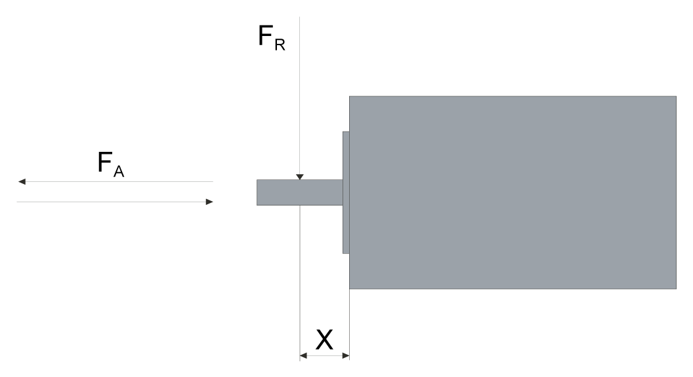

# Shaft Load

## General

If the maximum permissible forces at the motor shaft are exceeded, this will result in premature wear of the bearing or shaft breakage.

| WARNING | |
| --- | --- |
|  | UNINTENDED EQUIPMENT OPERATION DUE TO MECHANICAL DAMAGE TO THE MOTOR  * Do not exceed the maximum permissible axial and radial forces at the motor shaft. * Protect the motor shaft from impact. * Do not exceed the maximum permissible axial force when pressing components onto the motor shaft.  Failure to follow these instructions can result in death, serious injury, or equipment damage. |

## Force for Pressing On

The force applied during pressing on must not exceed the maximum permissible axial force. Applying assembly paste to the shaft and the component to be mounted reduces friction and mechanical impact on the surfaces.

If the shaft has a thread, use it to press on the component to be mounted. This way there is no axial force acting on the bearing.

It is also possible to shrink-fit, clamp or glue the component to be mounted.

The following table shows the maximum permissible axial force FA at standstill.

| Characteristic | Unit | Value | | | | | |
| --- | --- | --- | --- | --- | --- | --- | --- |
| SH3040 | SH3055 | SH3070 | SH3100 | SH3140 | SH3205 |
| Maximum axial force FA at standstill | N  (lbf) | 20  (4.5) | 40  (9) | 80  (18) | 160  (36) | 300  (65) | 740  (165) |

## Shaft Load

The following conditions apply:

* The permissible force applied during pressing on must not be exceeded
* Radial and axial limit loads must not be applied simultaneously
* Nominal bearing service life in operating hours at a probability of failure of 10% (L10h = 20000 hours)
* Mean speed of rotation n = 4000 rpm
* Ambient temperature = 40 °C (104 °F)
* Peak torque = Duty types S3 - S8, 10% duty cycle
* Nominal torque = Duty type S1, 100% duty cycle

Shaft load

The point of application of the forces depends on the motor size:

| Characteristic | Unit | Value | | | | | | |
| --- | --- | --- | --- | --- | --- | --- | --- | --- |
| SH3040 | SH3055 | SH30701, SH30702 | SH30703 | SH31001, SH31002, SH31003 | SH31004, SH3140 | SH3205 |
| Value for X | mm  (in) | 12.5  (0.49) | 10  (0.39) | 11.5  (0.45) | 15  (0.59) | 20  (0.76) | 25  (0.98) | 40  (1.57) |

The following tables show the maximum radial shaft load FR and the maximum axial shaft load FA for SH3040:

| Speed of rotation | Unit | Value | | | |
| --- | --- | --- | --- | --- | --- |
| SH30401 | | SH30402 | |
| FR | FA | FR | FA |
| 1000 rpm | N  (lbf) | 130  (29) | 26  (6) | 145  (32) | 29  (7) |
| 2000 rpm | N  (lbf) | 105  (24) | 21  (5) | 115  (26) | 23  (5) |
| 3000 rpm | N  (lbf) | 90  (20) | 18  (4) | 100  (22) | 20  (4) |
| 4000 rpm | N  (lbf) | 85  (19) | 17  (4) | 90  (20) | 18  (4) |
| 5000 rpm | N  (lbf) | 76  (17) | 16  (4) | 85  (19) | 17  (4) |
| 6000 rpm | N  (lbf) | 72  (16) | 15  (3) | 80  (80) | 16  (4) |
| 7000 rpm | N  (lbf) | 68  (15) | 14  (3) | 76  (17) | 15  (3) |
| 8000 rpm | N  (lbf) | 65  (15) | 13  (3) | 72  (16) | 14  (3) |
| 9000 rpm | N  (lbf) | 63  (14) | 12  (3) | 70  (16) | 13  (3) |
| 10000 rpm | N  (lbf) | 60  (13) | 11  (2) | 67  (15) | 12  (3) |

The following tables show the maximum radial shaft load FR and the maximum axial shaft load FA for SH3055:

| Speed of rotation | Unit | Value | | | | | |
| --- | --- | --- | --- | --- | --- | --- | --- |
| SH30551 | | SH30552 | | SH30553 | |
| FR | FA | FR | FA | FR | FA |
| 1000 rpm | N  (lbf) | 340  (76) | 68  (15) | 370  (83) | 74  (17) | 390  (88) | 78  (18) |
| 2000 rpm | N  (lbf) | 270  (61) | 54  (12) | 290  (65) | 58  (13) | 310  (70) | 62  (14) |
| 3000 rpm | N  (lbf) | 240  (54) | 48  (11) | 260  (58) | 52  (12) | 270  (61) | 54  (12) |
| 4000 rpm | N  (lbf) | 220  (49) | 44  (10) | 230  (52) | 46  (10) | 240  (54) | 48  (11) |
| 5000 rpm | N  (lbf) | 200  (45) | 40  (9) | 220  (49) | 44  (10) | 230  (52) | 46  (10) |
| 6000 rpm | N  (lbf) | 190  (43) | 38  (9) | 200  (45) | 40  (9) | 210  (47) | 42  (9) |
| 7000 rpm | N  (lbf) | 180  (40) | 36  (8) | 190  (43) | 38  (9) | 200  (45) | 40  (9) |
| 8000 rpm | N  (lbf) | 170  (38) | 34  (8) | 190  (43) | 38  (9) | 190  (43) | 38  (9) |

The following tables show the maximum radial shaft load FR and the maximum axial shaft load FA for SH3070:

| Speed of rotation | Unit | Value | | | | | |
| --- | --- | --- | --- | --- | --- | --- | --- |
| SH30701 | | SH30702 | | SH30703 | |
| FR | FA | FR | FA | FR | FA |
| 1000 rpm | N  (lbf) | 660  (148) | 132  (30) | 710  (160) | 142  (32) | 730  (164) | 146  (33) |
| 2000 rpm | N  (lbf) | 520  (117) | 104  (23) | 560  (126) | 112  (25) | 580  (130) | 116  (26) |
| 3000 rpm | N  (lbf) | 460  (103) | 92  (21) | 490  (110) | 98  (22) | 510  (115) | 102  (23) |
| 4000 rpm | N  (lbf) | 410  (92) | 82  (18) | 450  (101) | 90  (20) | 460  (103) | 92  (21) |
| 5000 rpm | N  (lbf) | 380  (85) | 76  (17) | 410  (92) | 82  (18) | 430  (97) | 86  (19) |
| 6000 rpm | N  (lbf) | 360  (81) | 72  (16) | 390  (88) | 78  (18) | 400  (90) | 80  (18) |

The following tables show the maximum radial shaft load FR and the maximum axial shaft load FA for SH3100:

| Speed of rotation | Unit | Value | | | | | | | |
| --- | --- | --- | --- | --- | --- | --- | --- | --- | --- |
| SH31001 | | SH31002 | | SH31003 | | SH31004 | |
| FR | FA | FR | FA | FR | FA | FR | FA |
| 1000 rpm | N  (lbf) | 900  (202) | 180  (40) | 990  (223) | 198  (45) | 1050  (236) | 210  (47) | 1070  (241) | 214  (48) |
| 2000 rpm | N  (lbf) | 720  (162) | 144  (32) | 790  (178) | 158  (36) | 830  (187) | 166  (37) | 850  (191) | 170  (38) |
| 3000 rpm | N  (lbf) | 630  (142) | 126  (28) | 690  (155) | 138  (31) | 730  (164) | 146  (33) | 740  (166) | 148  (33) |
| 4000 rpm | N  (lbf) | 570  (128) | 114  (26) | 620  (139) | 124  (28) | 660  (148) | 132  (30) | - | - |
| 5000 rpm | N  (lbf) | 530  (119) | 106  (24) | - | - | - | - | - | - |

The following tables show the maximum radial shaft load FR and the maximum axial shaft load FA for SH3140:

| Speed of rotation | Unit | Value | | | | | | | |
| --- | --- | --- | --- | --- | --- | --- | --- | --- | --- |
| SH31401 | | SH31402 | | SH31403 | | SH31404 | |
| FR | FA | FR | FA | FR | FA | FR | FA |
| 1000 rpm | N  (lbf) | 1930  (434) | 386  (87) | 2240  (504) | 448  (101) | 2420  (544) | 484  (109) | 2660  (598) | 532  (120) |
| 2000 rpm | N  (lbf) | 1530  (344) | 306  (69) | 1780  (400) | 356  (80) | 1920  (432) | 384  (86) | 2110  (474) | 422  (95) |
| 3000 rpm | N  (lbf) | 1340  (301) | 268  (60) | 1550  (348) | 310  (70) | 1670  (375) | 334  (75) | 1840  (414) | 368  (83) |

The following tables show the maximum radial shaft load FR and the maximum axial shaft load FA for SH3205:

| Speed of rotation | Unit | Value | | | | | |
| --- | --- | --- | --- | --- | --- | --- | --- |
| SH32051 | | SH32052 | | SH32053 | |
| FR | FA | FR | FA | FR | FA |
| 1000 rpm | N  (lbf) | 3730  (839) | 746  (168) | 4200  (944) | 840  (189) | 4500  (1012) | 900  (202) |
| 2000 rpm | N  (lbf) | 2960  (665) | 592  (133) | 3330  (749) | 666  (150) | 3570  (803) | 714  (161) |
| 3000 rpm | N  (lbf) | 2580  (580) | 516  (116) | 2910  (654) | 582  (131) | 3120  (701) | 624  (140) |

0198441113987.08