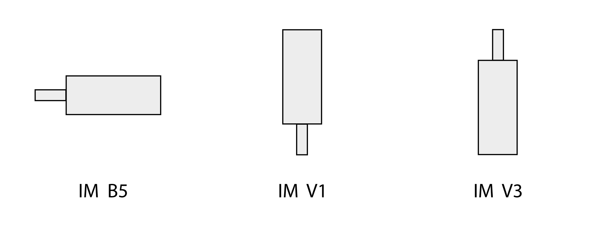
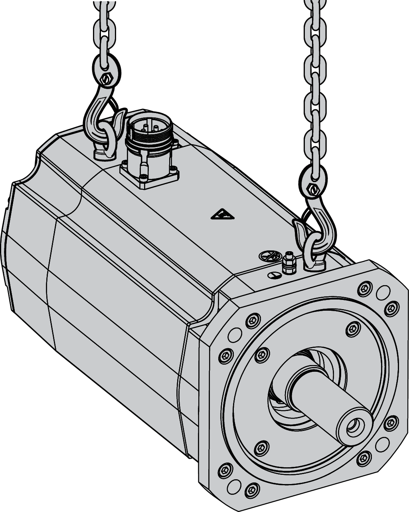

# Mounting The Motor

## General

Electrostatic discharge to the shaft may cause incorrect operation of the encoder system and result in unanticipated motor movements and damage to the bearing.

| WARNING | |
| --- | --- |
|  | UNINTENDED MOVEMENT CAUSED BY ELECTROSTATIC DISCHARGE  Use conductive components such as antistatic belts or other suitable measures to avoid static charge by motion.  Failure to follow these instructions can result in death, serious injury, or equipment damage. |

If the permissible environmental conditions are not respected, external substances from the environment may penetrate the product and cause unintended movement or equipment damage.

| WARNING | |
| --- | --- |
|  | UNINTENDED MOVEMENT  * Verify that the environmental conditions are respected. * Do not allow seals to run dry. * Keep liquids from getting to the shaft bushing * Do not expose the shaft sealing rings and cable entries of the motor to the direct spray of a pressure washer.  Failure to follow these instructions can result in death, serious injury, or equipment damage. |

The metal surfaces of the product may exceed 70 °C (158 °F) during operation.

| WARNING | |
| --- | --- |
|  | HOT SURFACES  * Avoid unprotected contact with hot surfaces. * Do not allow flammable or heat-sensitive parts in the immediate vicinity of hot surfaces. * Verify that the heat dissipation is sufficient by performing a test run under maximum load conditions.  Failure to follow these instructions can result in death, serious injury, or equipment damage. |

## Mounting Position

The following mounting positions are defined and permissible as per IEC 60034-7:

## Mounting

When the motor is mounted to the mounting surface, it must be accurately aligned axially and radially and make even contact with the mounting surface. All mounting screws must be tightened with the specified tightening torque. No uneven mechanical load must be applied when the mounting screws are tightened. See section [Technical Data](D-SE-0060238.html#D-SE-0060238) for data, dimensions and degrees of protection (IP).

## Eyebolts (SH3205 only)

The motors are equipped with eyebolts. Use the eyebolts to lift and mount the motor.

After the motor is mounted the eyebolts can be kept or removed. Remove the eyebolts if necessary, for example for rotating the connector.

## Mounting Output Components

Output components such as pulleys and couplings must be mounted with suitable equipment and tools. Motor and output component must be accurately aligned both axially and radially. If the motor and the output component are not accurately aligned, this will cause runout and premature wear.

The maximum axial and radial forces acting on the shaft must not exceed the maximum shaft load values specified, see [Shaft-specific Data](D-SE-0061806.html#D-SE-0061806).

If the maximum permissible forces at the motor shaft are exceeded, this will result in premature wear of the bearing or shaft breakage.

| WARNING | |
| --- | --- |
|  | UNINTENDED EQUIPMENT OPERATION DUE TO MECHANICAL DAMAGE TO THE MOTOR  * Do not exceed the maximum permissible axial and radial forces at the motor shaft. * Protect the motor shaft from impact. * Do not exceed the maximum permissible axial force when pressing components onto the motor shaft.  Failure to follow these instructions can result in death, serious injury, or equipment damage. |

0198441113987.08