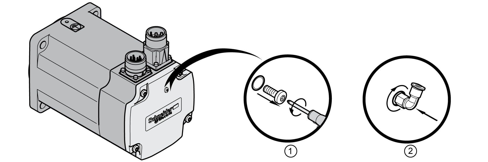

# Compressed Air Connection for Motors with Two-Cable Connection

## General

The compressed air generates a permanent overpressure inside the motor. This overpressure inside the motor is used to obtain degree of protection IP67.

The connection for compressed air is only suitable to reach the degree of protection IP67 in conjunction with the shaft sealing ring (IP65).

The push-in L-fitting is designed for compressed air hoses made of standard plastic with a nominal diameter of 4 mm.

See section [Compressed Air](D-SE-0061656.html#D-SE-0061656__D-SE-0061656.10) for the characteristics of the compressed air.

## Compressed Air Monitoring

Use a compressed air monitoring system.

## Compressed Air Connection

For installation, the existing screw plug is replaced by a push-in L-fitting. See section [IP67 Kit](D-SE-0061492.html#D-SE-0061492) for sources of supply of the push-in L-fitting.

| Step | Action |
| --- | --- |
| 1 | Remove the screw plug. |
| 2 | Screw the push-in L-fitting into the thread.  Verify proper seat of the push-in L-fitting.  Verify the tightening torque of the push-in L-fitting: 0.6 Nm (5.31 lb•in) |

0198441113987.08