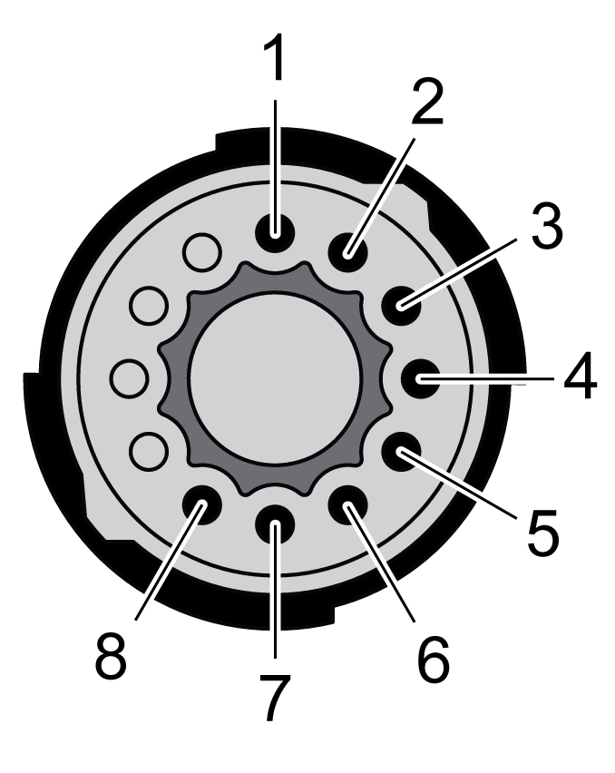
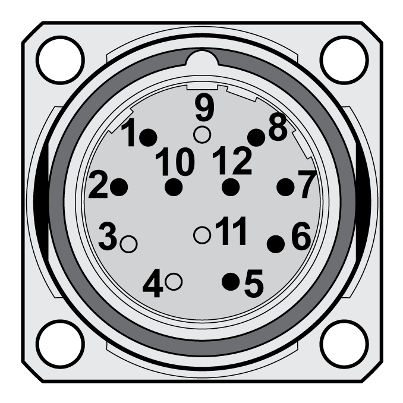

# Connectors and Connector Assignments for Motors With Two-Cable Connection

## Connection Overview

| Overview of the connections | | | | | | | | | | | |
| --- | --- | --- | --- | --- | --- | --- | --- | --- | --- | --- | --- |
| SH3040 | | | SH3055 | | | SH3070 | | | SH3100 | | |
|  | | |  | | |  | | |  | | |
| SH31401, SH31402 | | | | SH31403, SH31404 | | | | SH3205 | | | |
|  | | | |  | | | |  | | | |
| **(CN1)** Motor connection  **(CN2)** Encoder connection | | | | | | | | | | | |

## CN1 Motor Connection

Motor connector for connection of the motor phases and the holding brake.

|  |  |  |
| --- | --- | --- |
| Y-TEC | M23 | M40 |
|  |  |  |

The circuits of the holding brake and the temperature sensor meet the PELV requirements.

| Pin | Meaning | Accessory cable  Wire color and wire number |
| --- | --- | --- |
| U | Motor phase U | BK L1 or BK 1 |
| V | Motor phase V | BK L2 or BK 2 |
| W | Motor phase W | BK L3 or BK 3 |
| PE | Protective ground conductor | GN/YE |
| + | Supply voltage holding brake 24 Vdc | WH or BK 8 |
| - | Reference potential holding brake 0 Vdc | GY or BK 7 |
| T1 | Temperature sensor + | BK 6 |
| T2 | Temperature sensor - | BK 5 |
| SHLD | Shield (to connector housing) | - |

## CN2 Encoder Connection Y-TEC

Encoder connector for connection of the SinCos encoder (singleturn and multiturn)

The circuits meet the PELV requirements.

| Pin | Signal | Meaning | Pair(1) | Accessory cable  Wire color |
| --- | --- | --- | --- | --- |
| 1 | COS\_OUT | Cosine signal | 2 | GN |
| 2 | REFCOS\_OUT | Reference for cosine signal, 2.5V | 2 | YE |
| 3 | SIN\_OUT | Sine signal | 1 | WH |
| 4 | REFSIN\_OUT | Reference for sine signal, 2.5 V | 1 | BN |
| 5 | DATA+ | Receive data, transmit data | 3 | GY |
| 6 | DATA- | Receive data and transmit data, inverted | 3 | PK |
| 7 | ENC+10V | 7 ... 12 V supply voltage | 4 | RD |
| 8 | ENC\_0V | Reference potential(2) | 4 | BL |
|  | SHLD | Shield (to connector housing) | - | - |
| **(1)** Signal pairs must be twisted  **(2)** The ENC\_0V connection of the supply voltage has no connection to the encoder housing. | | | | |

## CN2 Encoder Connection M23

Encoder connector for connection of the SinCos encoder (singleturn and multiturn)

The circuits meet the PELV requirements.

| Pin | Signal | Meaning | Accessory cable  Wire color |
| --- | --- | --- | --- |
| 1 | REFCOS\_OUT | Reference for cosine signal, 2.5V | YE |
| 2 | DATA+ | Receive data, transmit data | GY |
| 5 | SIN\_OUT | Sine signal | BN |
| 6 | REFSIN\_OUT | Reference for sine signal, 2.5 V | WH |
| 7 | DATA- | Receive data and transmit data, inverted | PK |
| 8 | COS\_OUT | Cosine signal | GN |
| 10 | ENC\_0V | Reference potential(1) | BL |
| 12 | ENC+10V | 7 ... 12 V supply voltage | RD |
|  | SHLD | Shield (to connector housing) | - |
| **(1)** The ENC\_0V connection of the supply voltage has no connection to the encoder housing. | | | |

0198441113987.08