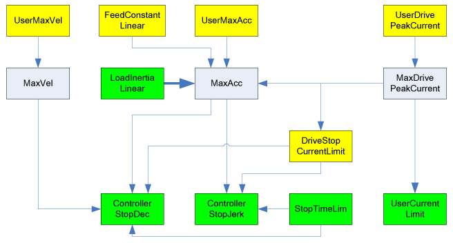

# MaxAcc

MaxAcc

General

|  |  |
| --- | --- |
| Type | AK |
| Devices supporting the parameter | Lexium LXM52 Drive, Lexium LXM52 Linear Drive,  Lexium LXM62 Drive, Lexium LXM62 Linear Drive,  Lexium ILM62 Drive Module,  Sercos Drive |
| Traceable | No |

Functional Description

Displays the maximum acceleration on the drive shaft (gear box outside) in [units / seconds^2].

Theoretically, this acceleration can be reached with 96 % of the peak torque if the moment of inertia [J\_Load](../Mechanic_2/Mechanic_2-6.htm#XREF_D_SE_0071843_1) and [J\_Gear](../Mechanic_2/Mechanic_2-7.htm#XREF_D_SE_0071844_1) is set correctly. In practice, there are deviations from this theoretical value that can be caused by

odeviations in the measurement,

odeviations in the torque constant or force constant or

odeviations in the moment of inertia or the mass.

The remaining 4 % are a controller reserve. This controller reserve is intended for

oovershoots of the controller,

ofriction moments or friction forces and

oother external moments or forces.

At high frictional torque, the controller reserve is not enough and the maximum acceleration cannot be reached. MaxAcc is adjusted automatically to changes of J\_Load and J\_Gear as long as it is not limited by [UserMaxAcc](General_2-5.htm#XREF_D_SE_0071527_1) also. The parameters [ViscousFriction](../Mechanic_2/Mechanic_2-9.htm#XREF_D_SE_0071846_1) and [StaticFriction](../Mechanic_2/Mechanic_2-8.htm#XREF_D_SE_0071845_1) have no effect on MaxAcc. Changes on J\_Load and J\_Gear are taken over directly; changes on UserMaxAcc are only taken over by a Sercos phase-start.

If by real axes UserMaxAcc is unequal zero, then the value for MaxAcc is only taken over by a Sercos phase up if it is smaller than the value calculated by the system.

If by virtual axes UserMaxAcc is unequal zero, then this value is taken over (by the Sercos phase up) in MaxAcc. This means, the value of UserMaxAcc is also taken over if it is higher than the standard value (by UserMaxAcc = 0).

NOTE:  Parameter values that are necessary to calculate MaxAcc are transferred from the slave to the master by the Sercos phase up. This means that if the Sercos bus is not in phase 4 (operating phase), a default value is indicated here.

The parameter is used by function blocks for generating the reference values in which an acceleration limitation is realized or where the acceleration for the references value profile can be parameterized. Limitations of the parameters [ControllerStopDec](General_2-10.htm#XREF_D_SE_0071532_1) and [ControllerStopJerk](General_2-11.htm#XREF_D_SE_0071533_1) depend on MaxAcc.

Special Features by Asynchronous Motors

With asynchronous motors, MaxAcc is calculated from data which may not be exact figures, only estimated. This may lead to the potential of the indicated value of MaxAcc being not equal to the real value that can be displayed on the drive.

The following graphic shows the dependency with other object parameters for rotary drives:

The following graphic shows the dependency with other object parameters for linear drives:

Yellow parameters are input parameters, whose values are taken over by the Sercos phase up. Green parameters are input parameters, whose values are taken over immediately. Gray parameters are output parameters. Thick arrows show that a parameter makes an impact on another parameter immediately by the input. Thin arrows show that a parameter does not have an impact until the next Sercos phase up or when the dependent parameter is entered. The arrow indicates the effective direction of the dependency.

Example:

Entering J\_Load has a direct impact on the parameter MaxAcc. A revision of MaxAcc only has an impact on ControllerStopDec if,

oa Sercos phase up takes place or

othe parameter ControllerStopDec is modified.

EIO0000003543.00

© 2018 Schneider Electric. All rights reserved.