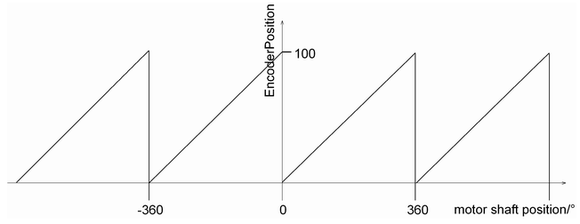

# EncoderPosition

EncoderPosition

General

|  |  |
| --- | --- |
| Type | AF |
| Devices supporting the parameter | Lexium LXM52 Drive, Lexium LXM52 Linear Drive,  Lexium LXM62 Drive, Lexium LXM62 Linear Drive,  Lexium ILM62 Drive Module,  Sercos Drive |
| Traceable | No |

Functional Description

EncoderPosition shows the actual position of the motor encoder within the [EncoderRange](Encoder_2-4.htm#XREF_D_SE_0071805_1) in units. It is indicated on the drive shaft (gear box output side). It is the actual position that is transferred via the Sercos bus (see [Reference and Actual Values](../RefActualValues/RefActualValues-1.htm#XREF_D_SE_0071489_1)). For single turn encoders, the EncoderPosition ranges from 0 to 1 revolutions (motor side), for multi-turn encoders, the EncoderPosition ranges from 0 to 4096 revolutions (motor side).

Coordinate displacement with SetPos ([FC\_SetposDual()](../../../../../../api/crossBook?lang=en-US&virtualBookName=PD.Lib.SystemInterface&topicID=D_SE_0085315_1), [FC\_SetposGroup()](../../../../../../api/crossBook?lang=en-US&virtualBookName=PD.Lib.SystemInterface&topicID=D_SE_0085317_1), [FC\_Setpos­Single()](../../../../../../api/crossBook?lang=en-US&virtualBookName=PD.Lib.SystemInterface&topicID=D_SE_0085319_1)) does not affect this parameter. The parameter [Direction](../Mechanic_2/Mechanic_2-4.htm#XREF_D_SE_0071840_1) must not be taken into account when interpreting EncoderPosition.

The EncoderPosition value is calculated once per Sercos cycle ([CycleTime](../../../../../../api/crossBook?lang=en-US&virtualBookName=PD.Parameter.LMCEco&topicID=D_SE_0073362_1)).

Relative to the actual position at the drive shaft, the position is delayed by the time [ShaftDelay](../RefActualValues/RefActualValues-9.htm#XREF_D_SE_0071500_1). Thus, a position within the encoder range is displayed that is delayed to the drive shaft by the ShaftDelay time.

Example

FeedConstant = 100 units/revolution

GearIn = GearOut (no gear box)

EncoderRange = 1 revolution (single turn)

Diagram for the parameter EncoderPosition of a drive

NOTE: The parameter value is transferred from the slave to the master via the parameter channel of the Sercos by every access. Typically, this takes about 10 ms. By a high capacity of the parameter channel, times up to 1 s can occur. If the Sercos bus is in phase 0 or 1, then a standard value is indicated here. If the Sercos bus is in phase 3 or 4, then the parameter value is transferred and indicated. In the Sercos phase 2, the parameter can be read through the application.

EIO0000003543.00

© 2018 Schneider Electric. All rights reserved.